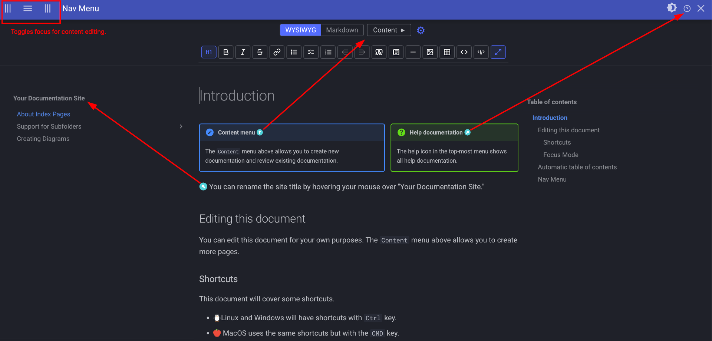

# mkdocs-live-wysiwyg-plugin

[](https://pypi.org/project/mkdocs-live-wysiwyg-plugin/)
[](https://marketplace.visualstudio.com/items?itemName=mkdocs-wysiwyg.mkdocs-wysiwyg)
[](https://open-vsx.org/extension/mkdocs-wysiwyg/mkdocs-wysiwyg)

An all-in-one editor for GitHub and mkdocs documentation.

1. Add [techdocs-preview.sh][1] to your `$PATH`.
2. Edit documentation across your projects.

<details class="note">
<summary>📝 A small CLI tutorial (click to expand)</summary>


## Try it out

Run `./techdocs-preview.sh` from this repository to view the documentation for this repository.

For a general tutorial, you can run the following command in an empty directory.

```bash
techdocs-preview.sh init
```

- `init` will initialized mkdocs documentation for any project.
- The tutorial itself provides a starting point for docs as well as teaching material.  About a 15 mins read.

I modify GitHub documentation for this repository with the following command.

```bash
techdocs-preview.sh -c -a docs
```

</details>


## Features

A WYSIWYG (What-You-See-Is-What-You-Get) editor for exiting `mkdocs` documentation.

- 🌈✨ Author quality of life features
  - 👁-👁 Focus mode with collapsible nav sidebar, editing tools, and table of contents.
  - 📝 Non-destructive editing is a top priority.  Minimal  `git diff` .
  - 🧜 Mermaid diagram editor with a unique feature: text on diagrams can be clicked to auto-select matching mermaid text.  Enables fast editing of existing diagrams.
  - 🗂️ File management: reorder files, content migrations, dead link scanning (for broken internal or external links), preview and manage images.  Refactors links to documents and intra-document links when headings are renamed.
  - 🔗 A URL pasted onto selected text creates a markdown link.  Headings can be copied to create intra-document links.  Hold Ctrl key to open links with a click.
  - 🍹🤌 Unified editor actions for WYSIWYG and Markdown modes (i.e. switching modes).
    - 🗡 Loss-less undo/redo history with a UI to access full redo history.  Switching modes has shared undo history.
    - 🐁 Cursor location memory: switching modes keeps cursor and scroll area in same document location.
    - 🛰 Text selections are preserved when the author switches modes.
- 💪 Mkdocs/backage rendering features
  - ✅ Toggle-able checklists (task lists): `- [ ]` and `- [x]` .
  - ✅ YAML frontmatter preserved when editing and switching modes.
  - ✅ MkDocs admonitions (`!!! note`, `!!! warning`, etc.) with settings gear for type, collapsible, placement, and more.
  - ✅ Markdown link styles preserved (inline, reference, shortcut).
  - ✅ Code blocks with WYSIWYG editable titles, language selector, and auto-indent settings.
  - ✅ Mermaid diagram editing with an embedded live editor (full-screen overlay).
  - ✅ Tables with contextual toolbar: insert/delete rows and columns, column alignment, and formatting settings.
  - ✅ Image dialog with autocomplete from the docs tree.
  - ✅ Emoji shortcode completion and full emoji picker.
  - ✅ Automated content migration to mkdocs-nav-weight.
- ℹ️ Other noteworthy features
  - ✅ Auto-conversions: inline typing of markdown syntax creates formatted text.
  - ✅ Balanced ASCII table formatting with configurable max width and per-table overrides.
  - ✅ Context-sensitive help panel (Ctrl+?).  Not as good as clippy 📎.
  - ✅ No external JavaScript; all assets are bundled locally within the mkdocs plugin.

The following is an annotated screenshot after running `techdocs-preview.sh init`.



## MkDocs Theme Support

Only the [Material for MkDocs](https://squidfunk.github.io/mkdocs-material/) theme is officially supported. Admonition styling and icons rely on Material theme CSS. Other themes may work but have not been tested.

**No breaking changes** to Material theme compatibility are allowed.

Support for admonition syntax (e.g. `!!! note`, `!!! warning`, etc.). Admonitions render as they would when the site is built by mkdocs.  Collapsible admonitions (`??? type`) and HTML details tags (`!!! details`) are also supported.

## Attributions

This plugin incorporates or depends on the following works:

| Component                  | Author                     | License | Link                       |
| -------------------------- | -------------------------- | ------- | -------------------------- |
| **@celsowm/markdown-wysiwyg** (WYSIWYG editor) | Celso Fontes               | MIT     | [GitHub](https://github.com/celsowm/markdown-wysiwyg) · [npm][2] |
| **marked** (Markdown parser) | Christopher Jeffrey, MarkedJS | MIT     | [GitHub](https://github.com/markedjs/marked) · [marked.js.org](https://marked.js.org) |
| **js-yaml** (YAML parser)  | Vitaly Puzrin              | MIT     | [GitHub](https://github.com/nodeca/js-yaml) |
| **mermaid** (Diagram renderer) | Knut Sveidqvist            | MIT     | [GitHub](https://github.com/mermaid-js/mermaid) · [mermaid.js.org](https://mermaid.js.org) |
| **mermaid-live-editor** (Diagram editor) | Knut Sveidqvist            | MIT     | [GitHub](https://github.com/mermaid-js/mermaid-live-editor) |
| **mkdocs-live-edit-plugin** (required dependency) | Eddy Luten                 | MIT     | [GitHub][3]                |

All listed components are distributed under the MIT License. See each project's repository for full license text.

All vendored JavaScript, CSS, and application builds are bundled locally in `mkdocs_live_wysiwyg_plugin/vendor/` — no external JavaScript or CSS is loaded at runtime. See [`vendor/README.md`](mkdocs_live_wysiwyg_plugin/vendor/README.md) for exact versions and license files.

[1]: https://raw.githubusercontent.com/samrocketman/mkdocs-live-wysiwyg-plugin/refs/heads/main/techdocs-preview.sh
[2]: https://www.npmjs.com/package/@celsowm/markdown-wysiwyg
[3]: https://github.com/eddyluten/mkdocs-live-edit-plugin
