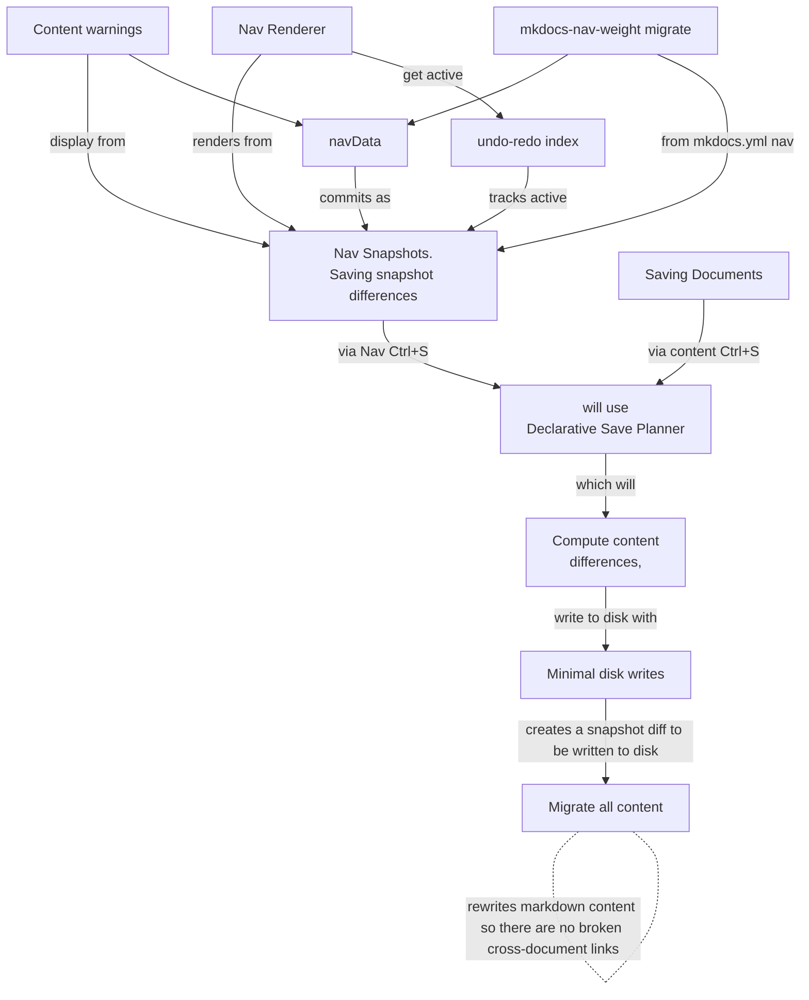
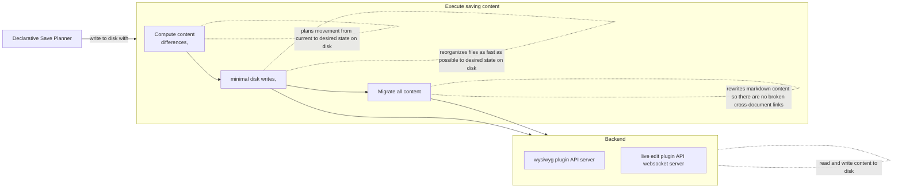

# Architecture Overview

The WYSIWYG plugin uses a snapshot-driven architecture where all content modifications flow through nav snapshots and a declarative save planner before reaching disk.

## High-Level Pipeline

## Snapshot-Driven Architecture

## Save Execution Pipeline

## Source of Truth

`liveWysiwygNavData` (and the snapshots derived from it) is the sole source of truth for all navigation operations — item positioning, movement, sibling lookup, weight computation, and save planning. The DOM is a rendering target rebuilt from the active snapshot on every change; it is never queried for item position, parent–child relationships, or ordering. DOM attributes (`data-nav-uid`, `data-nav-src-path`) exist only for event-to-data bridging (mapping click targets back to navData items) and post-operation visual focus (scrolling a moved item into view).

## More Information

For more detail see the following design documents.

- [DESIGN-centralized-keyboard.md](DESIGN-centralized-keyboard.md) -- Three-tier centralized keyboard handling architecture (dialog, global, editor).
- [DESIGN-declarative-save-planner.md](DESIGN-declarative-save-planner.md) -- Two-phase save architecture that separates desired end state from execution.
- [DESIGN-nav-migration.md](DESIGN-nav-migration.md) -- Migrating from mkdocs.yml nav key to mkdocs-nav-weight frontmatter-based ordering.
- [DESIGN-nav-weight-normalization.md](DESIGN-nav-weight-normalization.md) -- Nav weight normalization: rules, entry points, and the shared single-level algorithm.
- [DESIGN-popup-dialog-ux.md](DESIGN-popup-dialog-ux.md) -- Unified keyboard interaction model for all popups, dropdowns, and dialogs.
- [DESIGN-file-management.md](DESIGN-file-management.md) -- File management: single-item and multi-select group movement, unified save pipeline.
- [DESIGN-snapshot-nav-architecture.md](DESIGN-snapshot-nav-architecture.md) -- Centralized snapshot-driven architecture for the focus mode navigation menu.
