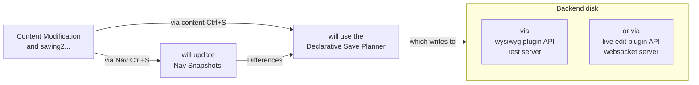
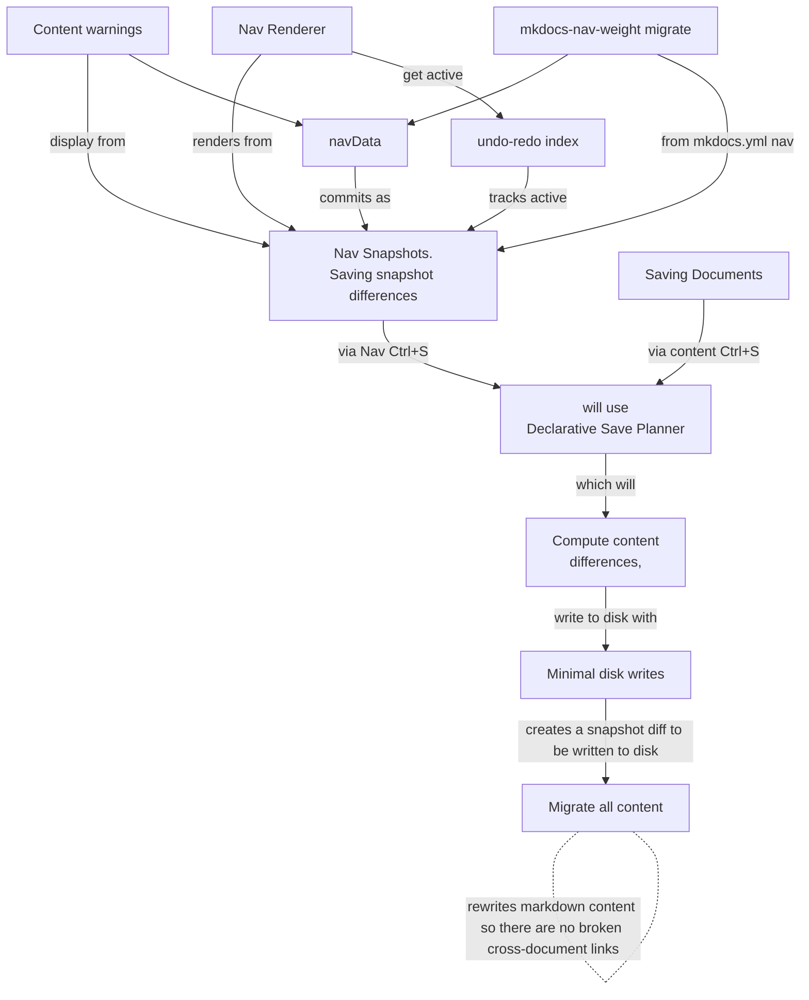
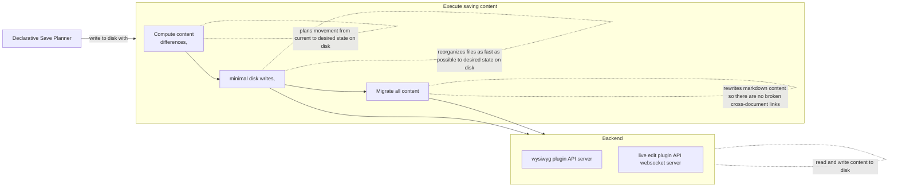

# Architecture Overview

The WYSIWYG plugin uses a snapshot-driven architecture where all content modifications flow through nav snapshots and a declarative save planner before reaching disk.

## High-Level Pipeline




## Snapshot-Driven Architecture




## Save Execution Pipeline




## Source of Truth

`liveWysiwygNavData` (and the snapshots derived from it) is the sole source of truth for all navigation operations — item positioning, movement, sibling lookup, weight computation, and save planning. The DOM is a rendering target rebuilt from the active snapshot on every change; it is never queried for item position, parent–child relationships, or ordering. DOM attributes (`data-nav-uid`, `data-nav-src-path`) exist only for event-to-data bridging (mapping click targets back to navData items) and post-operation visual focus (scrolling a moved item into view).

## Subsystem Directory

### Hierarchy Overview

```
UI Subsystem
  |-- Modes of Operation
  |     |-- Readonly Mode
  |     |-- Unfocused Mode
  |     |-- Focus Mode
  |     |-- Mermaid Mode (Layer 3)
  |-- Mermaid Subsystem
  |     |-- Mermaid Mode (UI, Layer 3 in mode hierarchy)
  |     |-- Vendor Subsystem (mermaid.js + mermaid-live-editor)
  |     |-- MkDocs YAML Mermaid Config (server-side detection + client-side auto-fix)
  |-- Toolbars
  |-- Content Editing
  |     |-- Editor Core
  |     |-- Cursor & Selection
  |     |-- Content History
  |     |-- Keyboard
  |     |-- Progressive Select All
  |     |-- Markdown Awareness
  |     |-- Dialog UX
  |     |-- Table of Contents
  |-- Nav Menu
  |     |-- Navigation Menu (data model, snapshots, batch editing)
  |     |-- Nav Renderer (exclusive DOM update authority)
  |     |-- File & Page Management
  |     |-- Nav Migration
  |-- Theming & Layout
  |     |-- Theme
  |     |-- Layout
  |-- Browser Compatibility

Backend Subsystem
  |-- MkDocs YAML Mermaid Config (config detection in plugin.py)
  |-- Save Pipeline (= Declarative Save Planner)
  |     |-- Snapshot Diff
  |     |-- Write Planner
  |     |-- Content Refactoring
  |-- Content Scanning
  |-- Cautions
  |-- API Server (wysiwyg plugin REST API)
  |     |-- Mermaid Session Server (session-based content brokering)
  |-- WebSocket Server (upstream live-edit-plugin)
  |-- Application Storage

Development Workflow (project conventions)
```

### UI Subsystem

#### Modes of Operation

- [DESIGN-modes-of-operation.md](ui/DESIGN-modes-of-operation.md) -- Mode lifecycle and transition contracts.
- [DESIGN-unfocused-mode.md](ui/DESIGN-unfocused-mode.md) -- Inline editing on the readonly page.
- [DESIGN-focus-mode.md](ui/DESIGN-focus-mode.md) -- Fullscreen editing overlay.
- [DESIGN-mermaid-mode.md](mermaid/DESIGN-mermaid-mode.md) -- Mermaid diagram editor (Layer 3 mode).

#### Mermaid Subsystem

Mermaid-related design documents are organized under `docs/design/mermaid/` while the architecture overview preserves the conceptual hierarchy.

- [DESIGN-mermaid-mode.md](mermaid/DESIGN-mermaid-mode.md) -- Layer 3 UI mode for mermaid diagram editing.
- [DESIGN-vendor-subsystem.md](mermaid/DESIGN-vendor-subsystem.md) -- Vendored mermaid.js and mermaid-live-editor.
- [DESIGN-mkdocs-yml-mermaid-config.md](mermaid/DESIGN-mkdocs-yml-mermaid-config.md) -- Server-side config detection and client-side auto-fix.

#### Toolbars

- [DESIGN-toolbars.md](ui/DESIGN-toolbars.md) -- WYSIWYG toolbar drawer and controls.

#### Content Editing

- [DESIGN-enter-bubble-navigation.md](ui/DESIGN-enter-bubble-navigation.md) -- Enter key block container exit.
- [DESIGN-targeted-markdown-revert.md](ui/DESIGN-targeted-markdown-revert.md) -- Backspace revert behavior.
- [DESIGN-raw-html-preservation.md](ui/DESIGN-raw-html-preservation.md) -- Raw HTML and comment preservation.
- [DESIGN-image-insertion-resize.md](ui/DESIGN-image-insertion-resize.md) -- Image insertion, resize, and settings.
- [DESIGN-readonly-selection-heuristics.md](ui/DESIGN-readonly-selection-heuristics.md) -- Read-only to edit mode text selection.
- [DESIGN-unified-content-undo.md](ui/DESIGN-unified-content-undo.md) -- DAG-based content undo/redo.
- [DESIGN-centralized-keyboard.md](ui/DESIGN-centralized-keyboard.md) -- Three-tier keyboard handling.
- [DESIGN-progressive-select-all.md](ui/DESIGN-progressive-select-all.md) -- Progressive Ctrl+A selection and cut/copy auto-expansion.
- [DESIGN-markdown-awareness.md](ui/DESIGN-markdown-awareness.md) -- Preprocess/postprocess round-trip and DOM enhancement contract.
- [DESIGN-popup-dialog-ux.md](ui/DESIGN-popup-dialog-ux.md) -- Unified dialog interaction model.
- [DESIGN-table-of-contents.md](ui/DESIGN-table-of-contents.md) -- Right sidebar TOC panel.

#### Nav Menu

- [DESIGN-focus-nav-menu.md](ui/DESIGN-focus-nav-menu.md) -- Navigation menu and batch editing.
- [DESIGN-snapshot-nav-architecture.md](ui/DESIGN-snapshot-nav-architecture.md) -- Snapshot-driven nav architecture.
- [DESIGN-file-management.md](ui/DESIGN-file-management.md) -- File management and movement.
- [DESIGN-nav-weight-normalization.md](ui/DESIGN-nav-weight-normalization.md) -- Weight normalization algorithm.
- [DESIGN-nav-migration.md](ui/DESIGN-nav-migration.md) -- Nav-to-weight migration.

#### Theming & Layout

- [DESIGN-theme-detection.md](ui/DESIGN-theme-detection.md) -- Theme detection and CSS variables.
- [DESIGN-layout.md](ui/DESIGN-layout.md) -- Positioning, animation, scroll, z-index, dropdown dismissal, and reparenting contracts.

#### Browser Compatibility

- [DESIGN-browser-compatibility.md](ui/DESIGN-browser-compatibility.md) -- Browser-specific quirks catalog.

### Backend Subsystem

#### MkDocs YAML Mermaid Config

- [DESIGN-mkdocs-yml-mermaid-config.md](mermaid/DESIGN-mkdocs-yml-mermaid-config.md) -- Config detection in `plugin.py`; client-side warning and auto-fix in integration script.

#### Save Pipeline

- [DESIGN-declarative-save-planner.md](backend/DESIGN-declarative-save-planner.md) -- Declarative two-phase save.

#### Content Scanning

- [DESIGN-content-scanning.md](backend/DESIGN-content-scanning.md) -- Dead link scanning and link rewriting.

#### Cautions

- [DESIGN-cautions.md](backend/DESIGN-cautions.md) -- Per-page warning system.

#### API Server

- [DESIGN-mermaid-session-server.md](backend/DESIGN-mermaid-session-server.md) -- Session-based content brokering between parent and mermaid-live-editor iframe.

#### Application Storage

- [DESIGN-application-storage.md](backend/DESIGN-application-storage.md) -- localStorage schema and persistence.

### CLI Utility

- DESIGN-cli-utility.md -- `techdocs-preview.sh` server lifecycle, configuration generation, dual mkdocs.yml mechanism, and mermaid superfences integration.

