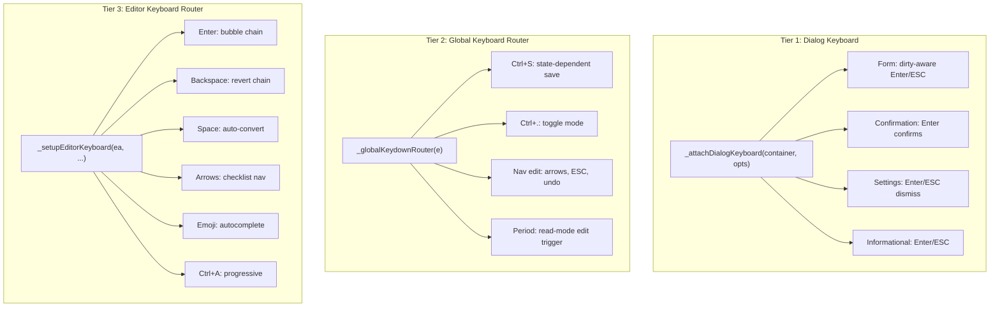

# Centralized Keyboard Handling

All keyboard event handling in the WYSIWYG editor flows through three centralized routers. Each router owns a single `addEventListener('keydown', ...)` registration for its domain. New keyboard behavior is added by inserting into the appropriate router — never by adding a standalone `addEventListener`.

All code lives in `live-wysiwyg-integration.js`.

## Three-Tier Architecture



| Tier | Function | Target | Phase | Registration |
|------|----------|--------|-------|-------------|
| 1 | `_attachDialogKeyboard(container, opts)` | Dialog/popup/dropdown element | Bubble | Called per-dialog; one handler per container |
| 2 | `_globalKeydownRouter(e)` | `document` | Capture | Registered once at startup |
| 3 | `_setupEditorKeyboard(ea, ...)` | `ea` (editable area) | Capture | Called once per editor initialization |

## Tier 1: `_attachDialogKeyboard(container, opts)`

A single reusable function that attaches Enter/ESC handling to any dialog, popup, dropdown, or panel. Replaces ~20 inline `addEventListener('keydown', ...)` calls that previously duplicated the same boilerplate.

### Function Signature

```javascript
/**
 * Attach unified keyboard handling to a dialog/popup/dropdown container.
 *
 * @param {HTMLElement} container - The dialog, overlay, dropdown, or popup element
 * @param {Object}      opts
 * @param {string}      opts.category    - 'form' | 'confirmation' | 'settings' | 'informational'
 * @param {Function}    opts.onDismiss   - Called on ESC, or Enter-when-clean (form), or Enter (settings)
 * @param {Function}   [opts.onConfirm]  - Called on Enter-when-dirty (form) or Enter (confirmation/informational)
 * @param {boolean}    [opts.trackDirty] - Auto-attach input/change listeners for dirty tracking
 * @param {Function}   [opts.isDirty]    - Custom dirty predicate (overrides auto-tracking)
 * @param {Function}   [opts.enterGuard] - If provided and returns false, Enter is not intercepted
 * @param {HTMLElement}[opts.autoFocus]   - Element to focus via requestAnimationFrame after attachment
 * @returns {Object}    { markDirty: Function } - API for programmatic dirty marking (smart defaults)
 */
function _attachDialogKeyboard(container, opts) { ... }
```

### Behavior by Category

| Category | ESC | Enter (no button focused) | Enter (button focused) |
|----------|-----|--------------------------|----------------------|
| `form` | Dismiss | Dirty: confirm. Clean: dismiss. | Native button click (Rule 11) |
| `confirmation` | Dismiss | Confirm | Native button click (Rule 11) |
| `settings` | Dismiss | Dismiss | Native button click (Rule 11) |
| `informational` | Dismiss | Confirm if `onConfirm` provided, else dismiss | Native button click (Rule 11) |

### What It Encapsulates

Written once, enforced everywhere:

1. ESC: `preventDefault`, `stopPropagation`, call `onDismiss`
2. Enter button-focus override (Rule 11 from DESIGN-popup-dialog-ux.md): check `document.activeElement` is a `<button>` inside `container`; if so, return without intercepting
3. Enter guard: if `opts.enterGuard` exists and returns `false`, return without intercepting
4. Enter routing by category (see table above)
5. Dirty tracking: `input`/`change` listeners on `container` when `trackDirty` is true
6. Auto-focus via `requestAnimationFrame`
7. Return value with `markDirty()` for programmatic dirty marking (smart defaults)

### Dialog Inventory

#### Form Dialogs

| Dialog | Function | `onConfirm` | Notes |
|--------|----------|-------------|-------|
| Create New Folder | `_promptNewFolder` | `createBtn.click()` | `trackDirty`, smart defaults mark dirty |
| Rename Page/Section | `_showRenameDialog` | `confirmBtn.click()` | `trackDirty` |
| Create New Page | `_showNewPageDialog` | `confirmBtn.click()` | `trackDirty`, weight smart default |
| Insert/Edit Link | `createLinkDropdown` | `doApply()` | `trackDirty`, clipboard smart default |
| Insert Image | `createImageInsertDropdown` | `doInsert()` | `trackDirty`, `enterGuard` for autocomplete visibility |
| Nav Settings Gear | `_showSettingsGear` | `_applySettingsGearChanges()` | Custom `isDirty`, conditional on Apply button |

#### Confirmation Dialogs

| Dialog | Function | `onConfirm` |
|--------|----------|-------------|
| Admonition Details Confirm | `_showAdmonitionDetailsConfirm` | `onProceed()` |
| Nav Dialog | `_showNavDialog` | `finish(confirmValue)` |
| Nav Dialog (HTML) | `_showNavDialogHtml` | `finish(confirmValue)` |
| Dead Link Wizard | `_showDeadLinkAnalysisWizard` | `applyBtn.click()` |

#### Settings Dropdowns

| Dialog | Function | Notes |
|--------|----------|-------|
| Code Block Settings | `createSettingsDropdown` | Dismiss only |
| Admonition Settings | `createAdmonitionSettingsDropdown` | Dismiss only |
| Focus Mode Settings | `_createSettingsDropdown` | Dismiss only |
| Image Gear | `_showImageGearDropdown` | Dismiss only |

#### Informational Popups

| Dialog | Function | `onConfirm` |
|--------|----------|-------------|
| Nav Popup | `_showNavPopup` | Click first action button |
| Caution Popup | `_showCautionPopup` | None (ESC only) |
| Dead Link Panel | `_showDeadLinkPanel` | None (ESC only) |
| Page Submenu | `_createPageSubmenu` | Click focused button |
| Language Dropdown | `createLangDropdown` | Select first language |

### Extensibility

To add a new dialog:

1. Build the dialog DOM as usual
2. Call `_attachDialogKeyboard(container, { category: '...', onDismiss: ..., onConfirm: ... })`
3. If the dialog has input fields, add `trackDirty: true`
4. If smart defaults pre-fill fields, call `api.markDirty()` after pre-filling

## Tier 2: `_globalKeydownRouter(e)`

A single document-level capture-phase handler that replaces ~8 separate `document.addEventListener('keydown', ...)` registrations. State flags replace dynamic add/remove.

### Routing Logic

```javascript
document.addEventListener('keydown', _globalKeydownRouter, true);

function _globalKeydownRouter(e) {
  if (_isDialogOpen()) return;

  if (e.key === 'Escape') {
    if (_navEditMode)              return _handleNavEditEscape(e);
    if (_admonitionDropdownOpen)   return _handleAdmonitionDropdownEscape(e);
    if (_reviewChangesPopupOpen)   return _handleReviewEscape(e);
  }
  if (_isCtrlOrCmd(e) && e.key === 's') {
    if (_focusModeRebuildPromptOpen) return _handleRebuildSave(e);
    if (_navEditMode)                return _handleNavSave(e);
    return _handleDocSave(e);
  }
  if (_isCtrlOrCmd(e) && e.key === '.') return _handleToggleMode(e);
  if (_navEditMode && e.key.indexOf('Arrow') === 0) return _handleNavArrowKeys(e);
  if (_navEditMode && _isUndoRedo(e)) return _handleNavUndoRedo(e);
  if (e.key === '.' && _isReadMode()) return _handlePeriodEdit(e);
}
```

### Handler Inventory

| Key | State Guard | Handler | Previously |
|-----|------------|---------|------------|
| Escape | `_navEditMode` | `_handleNavEditEscape` | Dynamic add/remove in `_enterNavEditMode`/`_exitNavEditMode` |
| Escape | `_admonitionDropdownOpen` | `_handleAdmonitionDropdownEscape` | Dynamic add/remove in `showDropdown`/`hideDropdown` |
| Escape | `_reviewChangesPopupOpen` | `_handleReviewEscape` | Dynamic add/remove in `_showReviewChangesPopup` |
| Ctrl+S | `_focusModeRebuildPromptOpen` | `_handleRebuildSave` | Dynamic add/remove in rebuild prompt |
| Ctrl+S | `_navEditMode` | `_handleNavSave` | Dynamic add/remove in `_enterNavEditMode`/`_exitNavEditMode` |
| Ctrl+S | (default) | `_handleDocSave` | Static IIFE `attachCtrlSSave` |
| Ctrl+. | (always) | `_handleToggleMode` | Static IIFE `attachCtrlDotToggle` |
| Arrow keys | `_navEditMode` | `_handleNavArrowKeys` | Dynamic add/remove in `_enterNavEditMode`/`_exitNavEditMode` |
| Ctrl+Z/Y | `_navEditMode` | `_handleNavUndoRedo` | Dynamic add/remove in `_enterNavEditMode`/`_exitNavEditMode` |
| Period | `_isReadMode()` | `_handlePeriodEdit` | Static anonymous handler |

### State Flags

Instead of dynamic `addEventListener`/`removeEventListener`, features set state flags:

| Flag | Set by | Cleared by |
|------|--------|------------|
| `_navEditMode` | `_enterNavEditMode` | `_exitNavEditMode` |
| `_admonitionDropdownOpen` | `showDropdown` | `hideDropdown` |
| `_reviewChangesPopupOpen` | `_showReviewChangesPopup` | Popup dismiss |
| `_focusModeRebuildPromptOpen` | Rebuild prompt show | Rebuild prompt resolve |

### Extensibility

To add a new global shortcut:

1. Add a state flag if the shortcut is context-dependent
2. Add a routing check in `_globalKeydownRouter` at the correct priority position
3. Create a `_handle*` function with the shortcut logic

## Tier 3: `_setupEditorKeyboard(ea, editableArea, wysiwygEditor)`

A single `ea`-level capture-phase handler that replaces ~16 separate anonymous handlers. Handler priority is explicit via line order in the router function.

### Priority Chain

The router dispatches by key, with handlers tried in priority order. Each handler returns `true` if it consumed the event, `false` otherwise.

#### Enter Priority (highest to lowest)

1. `_handleReverseBubble` — Exit containers at start (Cases A, B, C, D)
2. `_handleListEnterExit` — 2x Enter on empty LI exits list
3. `_handleAdmonitionEnterExit` — 3x Enter (or 1 with credit) exits admonition
4. `_handleBlockquoteEnterExit` — 3x Enter (or 1 with credit) exits blockquote
5. `_handleHeadingEnter` — Enter at start of heading inserts paragraph before
6. `_handleHiddenTitleAdmonitionEnter` — Enter at start of hidden-title admonition body
7. `_handleCodeBlockEnterExit` — Enter in title / 3x Enter exits code block

Reverse bubble **must** be first. This was previously enforced by handler registration order; now it is enforced by line order in the router.

#### Backspace Priority

1. `_handleChecklistBackspace` — Remove checkbox or delete checklist item
2. `_handleCodeBlockBackspace` — Revert/delete/exit code block
3. `_handleAdmonitionBackspace` — Exit empty admonition on backspace
4. `_handleMarkdownRevert` — Revert inline markdown elements, delete blocks

#### Other Keys

| Key | Handler |
|-----|---------|
| Space | `_handleMarkdownAutoConvert` — Block-level markdown conversions |
| Delete | `_handleImageDelete` — Delete selected image |
| ArrowLeft/Right | `_handleChecklistArrows` — Cursor normalization around checkboxes |
| Ctrl+A | `_handleSelectAllInBlock` — Progressive select-all |
| Emoji keys | `_handleEmojiKey` — Ctrl+Space, arrows, Enter/Tab, Backspace, printable (when autocomplete visible) |
| Various | `_maybeClearPendingBacktick` — Clear pending backtick state on Escape/Enter/arrows/Home/End/Page keys |

### Dataset Guard

A single dataset flag `liveWysiwygKeyboardRouterAttached` replaces the 16 individual flags (`liveWysiwygReverseBubbleAttached`, `liveWysiwygListEnterExitAttached`, etc.).

### Extensibility

To add a new editor keyboard handler:

1. Define a `_handle*` function inside `_setupEditorKeyboard` (closure over editor state)
2. The function returns `true` if it handled the event, `false` otherwise
3. Insert the function call in the router at the correct priority position for its key
4. Call `e.preventDefault()` and `e.stopImmediatePropagation()` inside the handler when consuming the event

## Rules

1. **No standalone `addEventListener('keydown', ...)`.** All keyboard handling goes through one of the three routers. The only exceptions are input-specific handlers that are internal to a dropdown's autocomplete (e.g., image URL input arrow keys for autocomplete navigation).

2. **Handlers return `true`/`false`.** In Tier 3, each handler function returns whether it consumed the event. The router stops dispatching on the first `true`. In Tier 2, handlers return after calling `preventDefault`/`stopPropagation`.

3. **Priority is line order.** In Tier 3, the order of `if (_handle*(e)) return;` lines defines handler priority. Do not reorder without understanding the implications (especially the enter-bubble chain).

4. **State flags over dynamic registration.** In Tier 2, context-dependent shortcuts use boolean flags checked by the router, not dynamic `addEventListener`/`removeEventListener`. This eliminates handler leak risks.

5. **Dialog-open guard in Tier 2.** The global router yields when any dialog overlay is open. Dialog-level keyboard handling (Tier 1) takes priority.

6. **Button-focus override in Tier 1.** When a `<button>` inside the dialog has focus, Enter is not intercepted. This is enforced by `_attachDialogKeyboard` and cannot be accidentally omitted.

7. **`enterGuard` for special cases.** Dropdowns with autocomplete or other sub-UIs that consume Enter use `opts.enterGuard` to conditionally bypass dialog-level Enter handling.

8. **Shift bypass in Tier 3.** The editor router checks `e.shiftKey` for Enter to allow Shift+Enter to pass through to browser default. This check is in the router, not in individual handlers.
