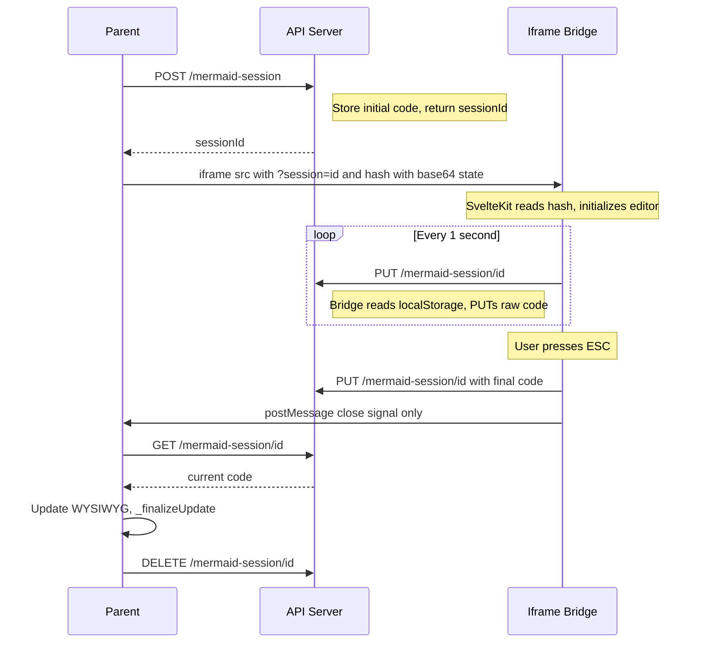

# Mermaid Session Server — Design Document

## Overview

The Mermaid Session Server is a subsystem of the API Server (REST API) that provides session-based content brokering between the parent WYSIWYG editor and the vendored mermaid-live-editor iframe. It eliminates all direct cross-origin content exchange by routing diagram code through the Python API server using a shared session token.

## Problem Statement

The parent page (MkDocs dev server, port 8000) and the mermaid-live-editor iframe (API server, dynamic port) are on different origins. Previous approaches attempted to relay content via:

- **URL hash**: The SvelteKit app re-serializes with `pako` compression immediately after loading, making subsequent hash reads unreliable. The bridge's `base64:` regex stopped matching.
- **`postMessage` with content**: Required the bridge to read the editor content and encode it. Monaco editor loads as an ES module with no global `monaco` object, so the editor API was inaccessible. `localStorage` worked for reads but added another dependency.
- **`contentDocument` access**: Blocked by the browser's same-origin policy.

Each approach required the iframe-side bridge script to scrape content from the vendor editor and relay it — a fragile coupling to vendor internals.

## Design: Server-Mediated Sessions

The API server holds an in-memory session that both clients (parent and iframe bridge) read from and write to via HTTP. Content never travels through `postMessage`. The bridge writes to the server; the parent reads from the server. `postMessage` is retained only for lightweight close signals (no content payload).



## API Endpoints

All endpoints are served by the existing API server in `api_server.py`.

### POST /mermaid-session

Create a new editing session.

- **Request body**: `{ "code": "<mermaid diagram code>" }`
- **Response**: `{ "sessionId": "<uuid>" }`
- **Side effect**: Stores the code in `_mermaid_sessions[sessionId]`.

### GET /mermaid-session/{id}

Retrieve the current diagram code.

- **Response**: `{ "code": "<mermaid diagram code>" }`
- **404** if session ID not found.

### PUT /mermaid-session/{id}

Update the diagram code.

- **Request body**: `{ "code": "<mermaid diagram code>" }`
- **Response**: 204 No Content.
- **404** if session ID not found.

### DELETE /mermaid-session/{id}

Destroy the session.

- **Response**: 204 No Content.
- **404** if session ID not found.

## Server-Side Storage

Sessions are stored in a module-level `dict` guarded by a `threading.Lock`:

```python
_mermaid_sessions = {}       # { sessionId: code_string }
_mermaid_sessions_lock = threading.Lock()
```

- **In-memory only**: Sessions are ephemeral. They exist only while the mermaid editor is open. No persistence is needed.
- **Single-user**: The API server is a local dev server. No authentication or authorization is required.
- **Thread-safe**: The API server uses `ThreadingMixIn`, so concurrent requests from the periodic sync timer and close/read are possible.

## Client Flows

### Parent (live-wysiwyg-integration.js)

**Enter mermaid mode** (`enterMermaidMode`):

1. Extract mermaid code from the source block's `<pre>` element.
2. POST to `/mermaid-session` with `{ code }`. Receive `sessionId`.
3. Store `_mermaidSessionId`.
4. Build iframe URL: `/mermaid-editor/edit?session={sessionId}#{base64-encoded-state}`.
5. The URL hash is still used for initial state delivery — the SvelteKit app's own `loadStateFromURL()` reads it natively. The session param is for the bridge.

**Exit mermaid mode** (`exitMermaidMode`):

1. GET `/mermaid-session/{id}` to retrieve the current code. This is the authoritative source.
2. Update the source block's `<pre>` with the retrieved code.
3. Re-render SVG preview, call `_finalizeUpdate`.
4. DELETE `/mermaid-session/{id}` to clean up.
5. Clear `_mermaidSessionId`.

**Close signal handling** (`onMermaidMessage`):

- On `live-wysiwyg-mermaid-close`: trigger `exitMermaidMode`. The message carries no content — the code is read from the server.
- On `live-wysiwyg-mermaid-update`: no-op or optional preview refresh (the server already has the latest code).

### Iframe Bridge (edit.html / index.html)

**Initialization**:

1. Parse `session` param from `window.location.search`.
2. Derive the API server base URL from `window.location.origin` (same-origin as the iframe).

**Periodic sync (1 second)**:

1. Read code from `localStorage.getItem("codeStore")` → `JSON.parse(raw).code`. The mermaid-live-editor app persists its Svelte store here under the `codeStore` key.
2. If code changed since last sync, PUT to `/mermaid-session/{id}` with `{ code }`.

**Close (ESC / Ctrl+S / request-close)**:

1. Read final code from `localStorage`.
2. PUT to `/mermaid-session/{id}` with `{ code }`.
3. Send lightweight `postMessage` to parent: `{ type: "live-wysiwyg-mermaid-close" }` (no `state` field). For Ctrl+S, add `save: true`.

## postMessage Protocol (Simplified)

All content is removed from postMessage payloads. Messages are signals only.

### Parent to Iframe

| Message Type | Payload | When |
|---|---|---|
| `live-wysiwyg-mermaid-request-close` | `{ type, save?: boolean }` | X button, parent ESC, parent Ctrl+S |

### Iframe to Parent

| Message Type | Payload | When |
|---|---|---|
| `live-wysiwyg-mermaid-close` | `{ type, save?: boolean }` | Response to request-close, ESC key, Ctrl+S |

`live-wysiwyg-mermaid-update` messages are no longer sent. The parent does not need real-time content updates — it reads the final code from the server on exit.

## What This Eliminates

- `_mermaidLastToken` state variable and all token caching logic.
- `_decodeMermaidState()` function — the server returns raw code.
- `_encodeState()` in the bridge — the bridge sends raw code to the server.
- `_resolveToken()` helper.
- Base64 encoding/decoding in the content sync path (only used for initial URL hash).
- All content in postMessage payloads.
- Dependency on Monaco/CodeMirror editor API access from the bridge.
- Cross-origin hash reading from the parent.

## What Stays the Same

- **Initial content delivery**: URL hash with `base64:` state. The SvelteKit app reads it natively.
- **`_encodeMermaidState()`**: Still needed to build the initial URL hash.
- **postMessage for close signals**: Lightweight signal only.
- **ESC overlay detection**: `_hasVisibleOverlay()` / `_isActuallyVisible()` in the bridge.
- **P8 preventDefault override**: Unchanged.
- **Keyboard isolation architecture**: Capture phase in bridge, Tier 2 guards in parent.

## State Variables

| Variable | Type | Purpose |
|---|---|---|
| `_mermaidSessionId` | string | Active session ID for API server communication. Set on enter, cleared on exit. |
| `_mermaidModeActive` | boolean | Mode active guard (unchanged). |
| `_mermaidOverlay` | Element | Overlay DOM reference (unchanged). |
| `_mermaidSourceBlock` | Element | The `.md-mermaid-block` being edited (unchanged). |
| `_mermaidIframe` | Element | Iframe reference for postMessage signals (unchanged). |

## Cross-References

- **Mermaid Mode**: [DESIGN-mermaid-mode.md](../mermaid/DESIGN-mermaid-mode.md) — Layer 3 UI mode, entry/exit flow, overlay DOM.
- **Vendor Subsystem**: [DESIGN-vendor-subsystem.md](../mermaid/DESIGN-vendor-subsystem.md) — Bridge script patches, vendor upgrade procedures.
- **Keyboard Isolation**: [DESIGN-centralized-keyboard.md](../ui/DESIGN-centralized-keyboard.md) — Two-document keyboard architecture.
- **API Server**: `api_server.py` — The parent HTTP server that hosts these endpoints.
