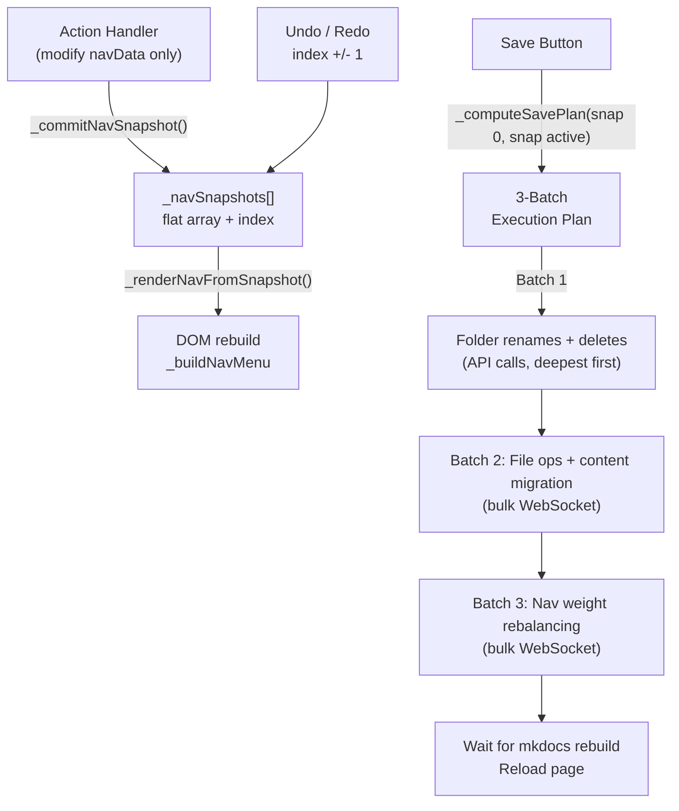

# Centralized Snapshot-Driven Nav Architecture

All changes in `[live-wysiwyg-integration.js](mkdocs-live-wysiwyg-plugin/mkdocs_live_wysiwyg_plugin/live-wysiwyg-integration.js)`.

## Current Problems

- ~12 call sites manually push snapshots; ~8 do the `_buildNavMenu` + `_addNavEditActions` dance
- Move functions manipulate DOM directly instead of modifying data
- Batch queue tracks individual operations during editing -- fragile, duplicative, order-dependent
- Content refactoring (link rewriting, weight updates) is interleaved with structural changes
- `_resolveChainedRename` needed because ops execute sequentially against a changing filesystem
- Migration is a special-cased flow with its own operation builder
- No way to do multi-rebuild workflows (e.g., rename file then rebalance all weights)
- Progress bar is per-batch, not centralized across multi-stage operations

## New Architecture




### Core Principles

1. **Actions only modify data.** No action handler touches the DOM. Actions modify `liveWysiwygNavData`, set data flags (`_renamed`, `_new`), then call `_commitNavSnapshot()`.
2. **DOM renders from active snapshot.** `_renderNavFromSnapshot()` rebuilds the DOM from `_navSnapshots[_navSnapshotIndex]`. All visual state comes from data flags.
3. **Save computes a phased plan from diff.** No batch queue during editing. On save, `_computeSavePlan()` diffs snapshot 0 vs active snapshot and produces a 3-batch execution plan.
4. **Content refactoring is a decoupled diff phase.** Link rewriting, title/weight updates, headless changes are all computed from the diff and applied in Batch 2, after all structural changes. This means any combination of navData mutations "just works" at save time.
5. **UIDs for cross-snapshot matching.** Every navData item gets a stable `_uid`. UIDs survive renames and moves.
6. **Persistent pipeline for multi-rebuild workflows.** Stored in localStorage, survives page reloads.

## Phase 1: Snapshot Infrastructure

### Assign UIDs to navData items

On page load, walk `liveWysiwygNavData` and assign `item._uid = _generateUid()` to every item (pages and sections). `_deepCloneNavData` already preserves all properties, so UIDs carry through to snapshot clones.

```javascript
var _uidCounter = 0;
function _generateUid() { return '__nav_' + (++_uidCounter); }

function _assignUids(items) {
  for (var i = 0; i < items.length; i++) {
    if (!items[i]._uid) items[i]._uid = _generateUid();
    if (items[i].children) _assignUids(items[i].children);
  }
}
```

### Flat snapshot array + index

Replace `_navUndoStack` / `_navRedoStack` with:

```javascript
var _navSnapshots = [];
var _navSnapshotIndex = -1;  // -1 = no snapshots yet
```

### Initial snapshot on page load

Take the initial snapshot right after `_buildNavMenu` is first called (in `enterFocusMode`). This captures the baseline state.

```javascript
_assignUids(liveWysiwygNavData);
_navSnapshots = [_takeNavSnapshot()];
_navSnapshotIndex = 0;
```

### Button visibility rule

- `**_navSnapshots.length < 2**`: No Save/Cancel/Undo/Redo buttons (no changes made)
- `**_navSnapshots.length >= 2**`: Buttons appear automatically

### Core functions

- `**_commitNavSnapshot()**`: Single entry point after any nav mutation
  1. Discard everything after `_navSnapshotIndex` (keep active, trim redo)
  2. Clone current state via `_takeNavSnapshot()` (navData with UIDs/flags, badges, UI flags)
  3. Push to `_navSnapshots`, advance `_navSnapshotIndex`
  4. Call `_renderNavFromSnapshot()`
- `**_renderNavFromSnapshot()**`: Single DOM update function
  1. Apply `_navSnapshots[_navSnapshotIndex]` data to globals
  2. `_navEditActionsEl = null`; `_buildNavMenu(_navSidebarEl)`
  3. If `_navSnapshots.length >= 2`: show `_addNavEditActions()`, update undo/redo states
  4. Otherwise: no action bar
- `**_navUndo()**`: Decrement `_navSnapshotIndex` (min 0), call `_renderNavFromSnapshot()`
- `**_navRedo()**`: Increment `_navSnapshotIndex` (max length-1), call `_renderNavFromSnapshot()`
- `**_updateUndoRedoBtns()**`: Undo disabled when `_navSnapshotIndex <= 0`. Redo disabled when `_navSnapshotIndex >= _navSnapshots.length - 1`.

### Simplified snapshot structure

No `batchQueue` in snapshots:

```javascript
{
  navData: [...],               // deep-cloned nav tree with _uid, _renamed, _new, _originalPath, etc.
  badges: [...],                // badge descriptors for UI
  focusTarget: '...',           // nav item to focus
  normalizeAllPending: false,   // user requested full rebalance
  normalizePending: false,      // user requested folder-level rebalance (section ref)
  migrationPending: false       // migration was staged
}
```

### Remove old infrastructure

- Remove `_navUndoStack`, `_navRedoStack`, `_pushNavOperation()`
- Remove `_navDataSnapshot`, `_allMdSrcPathsSnapshot`, `_navFrontmatterSnapshot`
- Remove `_navBatchQueue` (fully eliminated in Phase 3)

## Phase 2: Data-Only Mutations

### Data flags for visual states

- `item._renamed = true` -- renderer applies `live-wysiwyg-nav-item--renamed`
- `item._new = true` -- renderer applies `live-wysiwyg-nav-item--new`
- `item._originalPath = 'old/path.md'` -- set on rename, used by diff to detect renames

### New helper: `_findNavItemInTree(item)`

Returns `{ parent: Array, index: Number }` by matching `_uid`. Used by all move functions.

### Refactored move functions

Each finds the item in navData via `_findNavItemInTree`, modifies the parent's children array, does NOT touch DOM. `_commitNavSnapshot()` triggers re-render.

### `_promptNewFolder` becomes data-only

Create syntheticSection, set `._new = true`, assign `_uid`, insert into navData, `_commitNavSnapshot()`.

### `_computeNewWeight` (replaces `_updateInMemoryWeightFromDom`)

Reads sibling weights from navData instead of DOM children.

## Phase 3: Diff-Based Save with 3-Batch Execution

### `_computeSavePlan(original, current)`

Diffs snapshot 0 navData vs active snapshot navData by `_uid`. Produces a structured execution plan with three batches.

### Diff detection via `_flattenNavTree`

```javascript
function _flattenNavTree(items, parentUid, parentDir, result) {
  result = result || {};
  for (var i = 0; i < items.length; i++) {
    var item = items[i];
    var srcPath = _getItemSrcPath(item);
    var folderDir = item.type === 'section' ? _getSectionFolderDir(item) : null;
    result[item._uid] = {
      item: item, parentUid: parentUid, index: i,
      srcPath: srcPath, folderDir: folderDir,
      weight: _getItemWeight(item), title: item.title,
      headless: item.headless || (item.index_meta && item.index_meta.headless),
      parentDir: parentDir
    };
    if (item.children) {
      _flattenNavTree(item.children, item._uid, folderDir || parentDir, result);
    }
  }
  return result;
}
```

### Batch 1: Folder Renames + Folder Deletes (API calls)

Executed via `_apiPost('/rename-folder', ...)` and `_apiPost('/delete-folder', ...)`. These change paths on disk and must complete before file operations.

**Ordering rules:**

- **Folder renames**: deepest children first, parent last. A single section folder path may require multiple rename operations if nested folders were renamed. Example: renaming `docs/guides/` to `docs/tutorials/` where `docs/guides/advanced/` was also renamed to `docs/guides/expert/` -- rename `expert` first (deepest), then `tutorials` (parent).
- **Folder deletes**: no ordering needed for children (entire subtree deleted at once).

Detection:

- Folder rename: same `_uid`, different `folderDir`
- Folder delete: section `_uid` in original but not in current

### Batch 2: File Operations + Content Migration (bulk WebSocket)

All operations via existing `_wsDeleteFile`, `_wsNewFile`, `_wsSetContents`, `_wsGetContents`. Executed as fast as possible without waiting for rebuilds.

**Sub-phases within Batch 2:**

**2a. Delete individual files**

- File `_uid` in original but not in current
- `_wsDeleteFile(originalPath)`

**2b. Move/rename individual files**

- Same `_uid`, different `srcPath` or different `parentDir` → file needs to move
- Moving = delete old + create new + set contents (same as current `_executeMoveFolderOp`)
- Note: renaming a file is just moving it (to a different name in the same or different directory)
- All moves computed from original path → current path, no chained rename tracking needed

**2c. Create new files**

- `_uid` in current but not in original
- `_wsNewFile(path, '')` + `_wsSetContents(path, content)`

**2d. Content migration (the decoupled phase)**

This is the key innovation. After all structural changes (files are in their final locations), apply content-level changes:

- **Rewrite links**: For every moved/renamed file, fetch content from its NEW location, rewrite relative links to account for the directory change (`_rewriteOutboundLinks`). For every file that linked TO a moved/renamed file, rewrite those inbound links (`_rewriteInboundLinks` using the link index).
- **Dead link warnings**: For every deleted file, check the link index for files that referenced it. Add caution warnings to those files using the existing `_addCautionPage` infrastructure. This is a targeted check (only for files affected by this operation), NOT a full dead link scan.
- **Set frontmatter**: For items with changed `weight`, `title`, `headless`, or other frontmatter fields, fetch content, update frontmatter via `_updateFrontmatter`, write back.
- **Folder link rewriting**: For renamed folders, rewrite links in all pages that referenced files in the old folder path (using link index).

### Batch 3: Nav Weight Rebalancing (bulk WebSocket)

Three sources of folders to normalize (evaluated in priority order):

1. **Full rebalance** (`normalizeAllPending`): normalize all weights across the entire nav tree. If true, skip sources 2 and 3 entirely.
2. **Explicitly requested folders** (`normalizePending` sections): folders the user clicked "Normalize Nav Weights" on.
3. **New folders** (`_new = true` sections in active snapshot): folders created during editing automatically get their children's weights normalized.

Sources 2 and 3 are combined (deduplicated) into a single set of sections to normalize. Rebalancing reads file content from disk (files are in their final locations after Batch 2), computes normalized weights, and writes updated frontmatter via `_wsSetContents`.

### After all batches: wait for mkdocs rebuild, then reload

Close the bulk WebSocket (triggers rebuild), wait for rebuild completion (`_waitForRebuild`), then reload the page.

### `_resolveChainedRename` eliminated

With diff-based save, we always know the original path (snapshot 0) and the final path (active snapshot). No intermediate rename tracking needed. The diff produces a single `{ originalPath, finalPath }` for each moved/renamed item.

## Phase 4: Persistent Changes Pipeline

### `_changesPipeline` -- localStorage-backed array

```javascript
[
  {
    title: "Restructuring folders and files",
    batches: [
      { title: "Renaming folders", ops: [...], type: 'api' },
      { title: "Moving files and updating content", ops: [...], type: 'ws' },
      { title: "Rebalancing nav weights", ops: [...], type: 'ws' }
    ],
    completed: false
  }
]
```

### Centralized progress bar

```
Pipeline stages: N
Current stage: i
Batches in current stage: B
Current batch: b
Ops in current batch: M, completed: j

Overall = ((i / N) + ((b / B) + (j / M) * (1 / B)) * (1 / N)) * 100
```

Single progress bar element. Stage title + batch title displayed alongside.

### On page reload

Check localStorage for `_changesPipeline`. If incomplete stages remain, resume execution (enter focus mode, show progress bar, execute next stage).

### Migration simplified -- virtual refactoring via snapshot

Migration no longer needs its own operation builder (`_buildMigrationOps`) or any content-aware logic. It is purely a navData mutation:

1. `_startMigrationFlow()` computes the target nav structure (reuse `_migrationComputeTargetTree`)
2. Applies ALL structural changes to `liveWysiwygNavData` as a single atomic operation:
  - Move items between sections (splice from one children array, insert into another)
  - Create synthetic sections (`_new = true`, `_uid` assigned)
  - Update titles, weights, headless flags directly on navData items
  - Mark hidden items
  - Set `_migrationPending = true` (so save knows to also remove the `nav` key from mkdocs.yml)
3. Calls `_commitNavSnapshot()` once -- this is ONE snapshot representing the entire migrated state

The user now sees the final migrated nav in the sidebar. From this point, no special migration logic is needed:

- **Undo**: reverts to pre-migration state (snapshot index decrements). The migration disappears.
- **Redo**: restores the migrated state (snapshot index increments). The migration reappears.
- **Further edits**: the user can move items, rename things, adjust weights on top of the migration. Each edit creates a new snapshot. The snapshot system already handles all of this -- no migration-specific undo/redo code required.
- **Save**: `_computeSavePlan()` diffs snapshot 0 (original pre-migration state) against the active snapshot (migrated + user adjustments). The diff detects all moves, renames, creates, deletes, weight/title changes. Content refactoring (link rewriting, frontmatter updates) happens entirely at save time in Batch 2d. The `update-mkdocs-yml` operation (removing the nav key) is added as a pipeline stage because `_migrationPending` is true.

Migration is not a special case. It is just a large virtual refactoring of navData that produces one snapshot. Everything else -- undo, redo, further edits, save, content migration -- is handled by the existing snapshot and diff infrastructure.

## Phase 5: Light vs. Heavy Nav Edit Modes

Replace `_navEditMode` with tri-state:

```javascript
var _navEditMode = false;  // false | 'light' | 'heavy'
```

- `**false**`: Default display
- `**'light'**`: Weight/title/frontmatter changes. Content stays editable. Buttons visible when snapshots >= 2.
- `**'heavy'**`: Move/rename/delete/create. Content becomes readonly.

### Light operations

- Change weight, title, any frontmatter setting (settings gear)
- Normalize folder weights / all weights

### Heavy operations

- Move item (arrows), rename/delete/create file/folder, promote hidden, migration staging

### Transition

- Escalation from light to heavy: prompt user to save content first
- `if (_navEditMode)` truthy check works for both (backward compatible)

## Discard / Exit

- **Discard**: Restore `_navSnapshots[0]` to navData. Reset to `[initial]; index = 0`. Re-render.
- **Exit after save**: Clear `_navSnapshots = []; _navSnapshotIndex = -1`.
- Old snapshot globals (`_navDataSnapshot`, etc.) removed -- `_navSnapshots[0]` serves their purpose.

