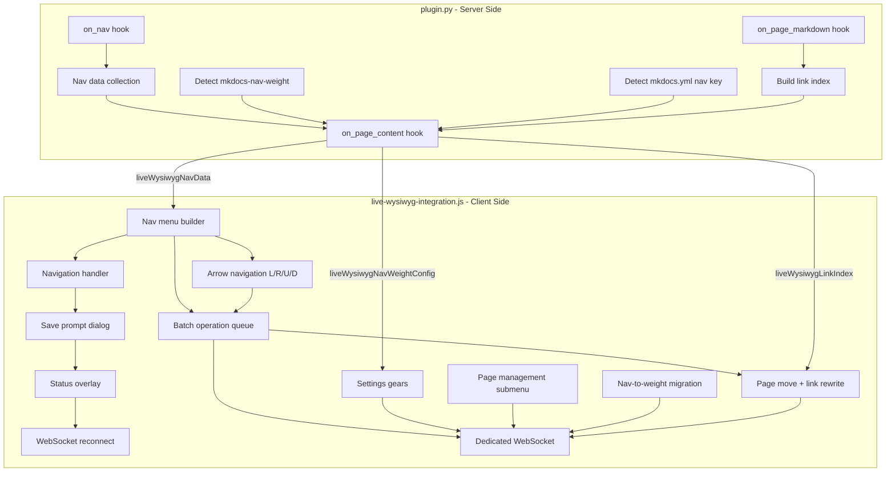

# Focus Mode Navigation Menu

## Architecture Overview




## Files to Modify

- **[plugin.py](mkdocs-live-wysiwyg-plugin/mkdocs_live_wysiwyg_plugin/plugin.py)** - Add `on_nav` hook, inject nav data + nav-weight config
- **[live-wysiwyg-integration.js](mkdocs-live-wysiwyg-plugin/mkdocs_live_wysiwyg_plugin/live-wysiwyg-integration.js)** - Nav menu UI, navigation flow, weight features

---

## Part 1: Server-Side Nav Data Collection (`plugin.py`)

### 1A. Add `on_nav` hook

Collect the full navigation tree when MkDocs builds it. Store as `self._nav_data` on the plugin instance. Include all mkdocs-nav-weight frontmatter fields for every page so JS has a complete picture.

```python
def on_nav(self, nav, config, files, **_):
    if not self.is_serving:
        return nav
    self._nav_data = self._collect_nav_tree(nav)
    self._nav_pages_flat = [
        {
            "url": p.url,
            "title": p.title or "",
            "src_path": p.file.src_path,
            "isIndex": p.file.src_path.endswith("index.md"),
            # Use None (-> JSON null) when not set, so JS can
            # distinguish "not declared" from "explicitly set to default"
            "weight": p.meta.get("weight"),       # number or None
            "headless": p.meta.get("headless"),    # bool or None
            "retitled": p.meta.get("retitled"),    # bool or None
            "empty": p.meta.get("empty"),          # bool or None
        }
        for p in nav.pages
    ]
    # All markdown src_paths in the docs directory (for identifying
    # unlisted pages during migration -- they need headless: true)
    self._all_md_src_paths = [
        f.src_path for f in files if f.src_path.endswith(".md")
    ]
    return nav
```

The `_collect_nav_tree` helper walks `nav.items` recursively, producing a JSON-serializable tree of sections and pages that mirrors the Material theme nav hierarchy.

The `_all_md_src_paths` list is injected into JS as `liveWysiwygAllMdSrcPaths` alongside the other data. It is used exclusively by the migration flow (Part 5) to identify pages not present in the `nav` that need `headless: true`.

### 1A-2. Add `on_page_markdown` hook for link index

Build a site-wide index of all relative content references in every page. This runs during `on_page_markdown` (called for every page during each build) and accumulates into `self._link_index`.

```python
import re

def on_page_markdown(self, markdown, page, config, files, **_):
    if not self.is_serving:
        return markdown
    src = page.file.src_path
    refs = []
    # Markdown links: [text](path) -- exclude absolute URLs, anchors, and images
    # Negative lookbehind (?<!!) prevents matching  as a plain link
    for m in re.finditer(r'(?<!!)\[([^\]]*)\]\(([^)]+)\)', markdown):
        target = m.group(2).split('#')[0].split('?')[0]
        if target and not target.startswith(('http://', 'https://', '#', 'mailto:')):
            refs.append({"type": "link", "target": target, "offset": m.start()})
    # Markdown images: 
    for m in re.finditer(r'!\[([^\]]*)\]\(([^)]+)\)', markdown):
        target = m.group(2).split('#')[0].split('?')[0]
        if target and not target.startswith(('http://', 'https://')):
            refs.append({"type": "image", "target": target, "offset": m.start()})
    # HTML  tags with relative src
    for m in re.finditer(r']+src=["\']([^"\']+)["\']', markdown):
        target = m.group(1)
        if target and not target.startswith(('http://', 'https://', 'data:')):
            refs.append({"type": "img_tag", "target": target, "offset": m.start()})
    # Reference-style links: [text][ref] and [ref]: url definitions
    for m in re.finditer(r'^\[([^\]]+)\]:\s+(\S+)', markdown, re.MULTILINE):
        target = m.group(2).split('#')[0].split('?')[0]
        if target and not target.startswith(('http://', 'https://', '#', 'mailto:')):
            refs.append({"type": "ref_def", "ref_id": m.group(1), "target": target, "offset": m.start()})
    if not hasattr(self, '_link_index'):
        self._link_index = {}
    self._link_index[src] = refs
    return markdown
```

**Index lifecycle:** `self._link_index` is **cleared at the start of each build cycle** (in `on_nav`, before any `on_page_markdown` calls) to avoid stale entries from deleted pages or previous rebuilds:

```python
def on_nav(self, nav, config, files, **_):
    if not self.is_serving:
        return nav
    self._link_index = {}  # Reset link index for this build cycle
    # ... rest of on_nav ...
```

During `mkdocs serve`, MkDocs may only rebuild changed pages on incremental rebuilds. Since `_link_index` is cleared each cycle, any page not rebuilt will lose its index entry. This is acceptable because the JS uses the index as a best-effort lookup -- missing entries mean those pages' inbound links won't be automatically rewritten, but no corruption occurs. A full rebuild (which occurs after bulk writes since many files change) repopulates the complete index.

The `_link_index` is injected into JS as `liveWysiwygLinkIndex` -- a map from `src_path` to an array of `{type, target, offset}` objects. JS uses this to:

- Update outbound links when a page is moved to a different folder (recompute relative paths from new location)
- Update inbound links across the entire site when a page is moved or renamed (find all pages that reference the moved page and rewrite their links)

### 1B. Detect mkdocs-nav-weight plugin and extract full config

In `on_nav` or `on_page_content`, inspect `config["plugins"]` to see if `mkdocs-nav-weight` is active. Extract **all** configuration options (user-customized values in `mkdocs.yml` or builtin defaults from the plugin):

```python
nav_weight_plugin = config["plugins"].get("mkdocs-nav-weight")
if nav_weight_plugin:
    nw_config = {
        "enabled": True,
        # Plugin-level config (mkdocs.yml or builtin defaults)
        "section_renamed": nav_weight_plugin.config.get("section_renamed", False),
        "index_weight": nav_weight_plugin.config.get("index_weight", -10),
        "warning": nav_weight_plugin.config.get("warning", True),
        "reverse": nav_weight_plugin.config.get("reverse", False),
        "headless_included": nav_weight_plugin.config.get("headless_included", False),
        "default_page_weight": nav_weight_plugin.config.get("default_page_weight", 0),
        # Per-page frontmatter defaults (derived from plugin config)
        "frontmatter_defaults": {
            "weight": nav_weight_plugin.config.get("default_page_weight", 0),
            "index_weight": nav_weight_plugin.config.get("index_weight", -10),
            "headless": False,
            "retitled": False,
            "empty": False,
        },
    }
else:
    nw_config = {"enabled": False}
```

The `frontmatter_defaults` sub-object gives JS a single source of truth for what value each frontmatter field resolves to when omitted. This is critical for:

- Pre-filling the settings gear with effective values
- Determining when a user-set value matches the default (and should be removed from frontmatter)

All six plugin config parameters from [mkdocs-nav-weight](https://github.com/shu307/mkdocs-nav-weight) are included:

- `section_renamed` (bool, default `false`) - use index.md title as section name globally
- `index_weight` (number, default `-10`) - weight for index.md pages
- `warning` (bool, default `true`) - warn on invalid metadata
- `reverse` (bool, default `false`) - sort highest-to-lowest
- `headless_included` (bool, default `false`) - include headless pages in nav.pages
- `default_page_weight` (number, default `0`) - weight when frontmatter `weight` is absent

### 1C. Detect mkdocs.yml `nav` key

Check whether the user's `mkdocs.yml` has a `nav` key defined. This is needed by the JS to show the nav+weight coexistence warning and the migration flow.

```python
has_nav_key = config.get("nav") is not None
```

### 1D. Inject into JS preamble

In `on_page_content`, add these `const` declarations:

- `liveWysiwygNavData` - hierarchical nav tree (sections + pages with URLs, titles, weights, src_paths). Each page entry includes `weight` (from `page.meta.get("weight")` — `null` if not explicitly set in frontmatter, so JS can distinguish "default" from "explicitly set to default value"), `headless`, `retitled`, `empty`, and `isIndex` (whether the page is an index.md).
- `liveWysiwygNavWeightConfig` - full mkdocs-nav-weight config (all 6 plugin params + `frontmatter_defaults`)
- `liveWysiwygHasNavKey` - boolean indicating whether `mkdocs.yml` has a `nav` key
- `liveWysiwygAllMdSrcPaths` - flat list of all `.md` file src_paths in docs directory (for migration headless marking)
- `liveWysiwygLinkIndex` - map of `src_path` → array of `{type, target, offset}` content references (for page move link rewriting)

### 1E. Early focus-mode cookie detection script

Inject a small inline `<script>` at the top of every page that checks for `live_wysiwyg_focus_nav` cookie. If set, immediately creates a full-viewport overlay styled identically to focus mode (prevents any visual flash of the normal page). This overlay shows "Establishing connection..." and is later replaced or absorbed by the real focus mode initialization.

---

## Part 1F: Remote File Edit Reload Rule

**Any file edit performed via the dedicated WebSocket (not the current page's editor) triggers a seamless pause-and-reload of focus mode.** This applies regardless of whether "Remain in Focus Mode on Save" is checked -- it is the inherent behavior whenever the WYSIWYG plugin writes to:

- Another page's YAML frontmatter (e.g., folder index.md settings)
- `../mkdocs.yml` (e.g., updating `default_page_weight`, adding plugin, removing `nav`)
- Any file via bulk normalization or migration

The flow is identical to the "Remain in Focus Mode on Save" reload:

1. Block livereload via XHR monkey-patch
2. Perform the write(s) via dedicated WebSocket
3. Show status overlay ("Applying changes...", "Waiting for MkDocs rebuild...")
4. Set `live_wysiwyg_focus_nav` cookie pointing to the current page
5. After all writes acknowledged, unblock livereload and navigate to current page
6. Early-inject overlay catches the reload, standard reconnection logic applies

**Apply suggestion buttons:** Every suggestion in the UI that proposes a change to `mkdocs.yml` must include an "Apply" button. Clicking "Apply" performs a surgical edit -- it reads the current `mkdocs.yml` via `get_contents`, modifies only the specific setting being suggested (preserving all other content), and writes it back via `set_contents`. The Apply button is **disabled** when the current page has unsaved modifications (detected via `.live-edit-save-button:not([disabled])`), with a note explaining "Save the current page before applying."

---

## Part 1G: "Remain in Focus Mode on Save" Checkbox

### UI placement

A new checkbox in the focus mode toolbar drawer, placed **below** the existing "Auto Focus" checkbox. Both checkboxes are vertically stacked (one on top of the other) in a column layout.

```
div.live-wysiwyg-focus-drawer-controls
  ...existing controls (mode toggle, save, cancel, exit)...
  div.live-wysiwyg-focus-checkboxes (flex-column container)
    label.live-wysiwyg-focus-autofocus-label
      input[type=checkbox].live-wysiwyg-focus-autofocus-cb
      "Auto Focus"
    label.live-wysiwyg-focus-remain-label
      input[type=checkbox].live-wysiwyg-focus-remain-cb
      "Remain in Focus Mode on Save"
```

The existing `autofocusLabel` is reparented into this new wrapper div so both checkboxes are vertically aligned.

### Cookie

- Cookie name: `live_wysiwyg_focus_remain`
- Values: `1` (enabled) / `0` (disabled)
- Default: unchecked (`0`)
- Persists across page navigations (same `max-age=31536000;SameSite=Lax` pattern as other cookies)

### Save behavior when enabled

When the "Remain in Focus Mode on Save" checkbox is checked, the **Save button** and **Cmd+S** in focus mode trigger the same seamless reload flow used for nav-link navigation, except the target URL is the current page:

1. Show status overlay: "Saving content..."
2. Perform the save (trigger upstream `.live-edit-save-button.click()`)
3. Set `live_wysiwyg_focus_nav` cookie (same as nav-link flow) pointing to the current page URL
4. After a short delay (to let the save complete), navigate to the current page URL
5. The early-inject overlay catches the reload, shows "Establishing connection..."
6. Same websocket reconnection / retry logic as Part 3D applies

When the checkbox is **unchecked**, Save and Cmd+S behave as they do today (save in-place, no reload, remain in focus mode without interruption).

### Why reload on save

When MkDocs `serve` receives a file save over the websocket, it rebuilds the site and pushes a page reload. By proactively controlling this reload (navigate to self), we avoid the uncontrolled browser reload that would destroy focus mode. The user sees a smooth "saving... reconnecting..." transition instead of a flash.

---

## Part 2: Focus Mode Nav Menu (JS)

### 2A. Build nav menu in left sidebar

**Material theme requirement:** The nav menu is only available when the site uses the Material for MkDocs theme (`mkdocs-material`). At runtime, the nav menu builder checks for the Material theme (e.g., presence of `--md-primary-fg-color` on `:root` or `document.querySelector('.md-header')` existence). If a non-Material theme is detected, the left sidebar remains blank (12.1rem empty space as before) and all nav-menu-related features (arrows, settings gears, page management submenu, batch editing, migration) are disabled. This is a hard requirement due to the complexity of nav menu styling and its deep reliance on Material's CSS class hierarchy. Other themes can still be used with the rest of the WYSIWYG editor, but there is no guarantee the editor will work fully with non-Material themes. Material is the only fully supported theme.

Currently `div.live-wysiwyg-focus-sidebar-left` is a 12.1rem blank space. When Material theme is detected, populate it with a nav tree using Material theme classes:

```
div.live-wysiwyg-focus-sidebar-left
  nav.md-nav.md-nav--primary
    ul.md-nav__list
      li.md-nav__item [md-nav__item--active for current section]
        span.md-nav__link (section title, non-clickable)
        nav.md-nav
          ul.md-nav__list
            li.md-nav__item
              a.md-nav__link [md-nav__link--active for current page]
                span.md-ellipsis (page title)
```

- Current page highlighted with `md-nav__link--active`
- Sections are expandable (open by default for section containing current page)
- Styled with CSS injected in `_getFocusModeCSS()` to match readonly sidebar appearance
- Scrollable if nav is taller than viewport

### 2B. Nav menu CSS

Add styles in `_getFocusModeCSS()` for the nav sidebar, matching `md-sidebar--primary` styling:

- Font size, padding, link colors matching Material theme CSS variables
- Active state styling
- Hover effects
- Overflow-y auto for scrolling
- Hide on narrow viewports (same breakpoint as existing sidebar)
- When mkdocs-nav-weight is active: styles for 4-direction arrows (L/R/U/D), settings gear, target icon, question mark icons, warning icons
- Nav edit mode visual states:
  - `.live-wysiwyg-nav-item--renamed` / `.live-wysiwyg-nav-item--new`: green transparent background (e.g., `rgba(92, 184, 92, 0.15)`)
  - `.live-wysiwyg-nav-item--deleted`: transparent red background (e.g., `rgba(217, 83, 79, 0.15)`) with `text-decoration: line-through` on the link text, arrows/gear hidden, target icon hidden
  - `.live-wysiwyg-nav-item--focus-target`: white transparent background (e.g., `rgba(255, 255, 255, 0.15)`), theme-adaptive. If combined with green, green takes priority with white as subtle overlay/border
  - `.live-wysiwyg-nav-item--deleted:hover`: tooltip popup "This page will be deleted when the navigation menu is saved."
- Checkbox wrapper `.live-wysiwyg-focus-checkboxes`: `display: flex; flex-direction: column; gap: 2px` so Auto Focus and Remain in Focus Mode on Save stack vertically and align

---

## Part 3: Navigation Flow

### 3A. Save prompt dialog

When user clicks a nav link and the page has unsaved changes (detect via `.live-edit-save-button:not([disabled])` existence), show a modal dialog:

```
div.live-wysiwyg-focus-nav-dialog (modal overlay)
  div.live-wysiwyg-focus-nav-dialog-content
    p "The page appears to have changed. Would you like to save and then navigate away?"
    button "Save and leave" (accent color)
    button "Cancel" (neutral)
```

Styled similarly to the existing `md-image-dialog` pattern (native `<dialog>` element).

### 3B. Status overlay

After save (or if no changes), display status messages in the focus mode content area:

```
div.live-wysiwyg-focus-nav-status (centered in content area, replaces editor temporarily)
  span.live-wysiwyg-focus-nav-status-icon (spinner)
  span.live-wysiwyg-focus-nav-status-text
```

Status progression:

1. "Saving content..." (if saving)
2. "Navigating to [page title]..."
3. "Establishing connection..." (after page load)
4. "Re-establishing connection... (attempt N/4)" (on retry)
5. "Connection established" (success, then fade and show editor)
6. "Connection could not be established. Press ESC to exit focus mode." (failure after 4 tries)

### 3C. Cookie-based seamless transition

Before navigation:

1. Set cookie `live_wysiwyg_focus_nav=1` (short-lived, e.g. 60s max-age)
2. Set cookie `live_wysiwyg_focus_nav_target` with the target page title (for status message)

On page load (early-inject script from Part 1D):

1. Check for `live_wysiwyg_focus_nav` cookie
2. If present, immediately create focus-mode-like overlay with "Establishing connection..." status
3. Delete the cookie (one-time use)

### 3D. WebSocket reconnection logic

After a page navigation (whether from nav link click, batch save, or livereload intercept), the early overlay is showing on the new page:

**Primary: Wait for editor readiness**

1. Wait for `.live-edit-source` textarea to appear (indicates the live-edit WebSocket connected and the editor is ready)
2. On detection: initialize WYSIWYG editor, enter focus mode, the early overlay is replaced by real focus mode
3. Update status: "Connection established" (brief, then fade to editor)

**Fallback: Retry with page refresh**

1. If `.live-edit-source` does not appear within 5 seconds, refresh the page (incrementing a retry counter stored in cookie)
2. Maximum 3 refreshes (4 total attempts, 5 seconds each)
3. After all retries exhausted (~25 seconds from page load), show error message with ESC instruction: "Connection could not be established. Press ESC to exit focus mode."

The retry counter is tracked via cookie `live_wysiwyg_focus_nav_retry` (values 0-3), cleared on success.

**Note:** For bulk operations, the rebuild detection is handled by the livereload intercept in 4B Phase 3. The reconnection logic here (3D) handles the post-navigation WebSocket reconnection that follows, and also serves as the standalone reconnection for simple page-to-page navigation (which does not involve a rebuild wait).

---

## Part 4: mkdocs-nav-weight Integration

All features in this part only render when `liveWysiwygNavWeightConfig.enabled === true`.

### 4A. Dedicated WebSocket for Bulk Operations

The WYSIWYG plugin creates its own WebSocket connection to the live-edit server for reading/writing arbitrary files. This is separate from the live-edit plugin's own internal connection.

- **Connection:** `new WebSocket('ws://' + location.hostname + ':' + ws_port)` (the `ws_port` global is injected by the live-edit plugin's preamble and is available to our script)
- **Used for:** Reading other pages' content via `get_contents`, writing frontmatter updates via `set_contents`, and writing to `../mkdocs.yml` if needed
- **Created lazily:** Only opened when a nav-weight operation needs it (not on every page load)
- **Protocol:** Same JSON `{action, path, contents}` as the live-edit plugin

### 4B. Bulk Write Protocol

All multi-file operations (normalization, migration, batch nav save, mkdocs.yml edits, folder index.md creation) follow the same protocol. This is the single pattern referenced by all later sections.

**Phase 1: Block and disable**

- Block livereload by monkey-patching `XMLHttpRequest.prototype.open` (see below)
- Disable the editor content area (non-interactive)
- Show progress bar overlay

**Phase 2: Immediate writes**

- All `set_contents` messages are dispatched to the dedicated WebSocket **as fast as possible** -- do not wait for MkDocs to process or rebuild between individual writes
- Progress bar advances on each `set_contents` acknowledgment
- Status detail shows the current file being written (e.g., "Writing page 3 of 12: guide/setup.md")

**Phase 3: Rebuild detection and reconnection (hybrid approach)**

MkDocs' livereload long-poll endpoint (`/livereload/<epoch>/<id>`) is the only reliable signal that a rebuild has completed. Requests that arrive during a rebuild are stalled by the server until the rebuild finishes. The reconnection strategy exploits this:

**Primary: Livereload intercept**

1. After all writes acknowledged, update status to "MkDocs rebuild in progress..." with an animated progress indicator (indeterminate/pulsing bar -- we don't know the rebuild duration)
2. Set `live_wysiwyg_focus_nav` cookie for focus mode re-entry
3. Unblock the XHR monkey-patch (`window.__liveWysiwygBlockReload = false`)
4. Instead of letting the livereload script call `location.reload()`, **intercept** the livereload response by monkey-patching the livereload script's reload behavior: replace `location.reload()` with a controlled navigation to the target page (`_navFocusTarget` or current page)
5. The livereload long-poll will stall until MkDocs finishes rebuilding, then return -- this triggers the controlled navigation
6. Update status to "Rebuild complete, navigating..."
7. Navigate to the target page URL
8. Early-inject overlay on the new page shows "Establishing connection..."
9. Wait for `.live-edit-source` textarea to appear (indicates the live-edit WebSocket reconnected)
10. On success: enter focus mode, editor becomes interactive with fresh nav data

**Fallback: Retry-based refresh**

While waiting for the livereload response, the status overlay includes a **"Check now"** button below the pulsing progress bar. The button is **disabled for the first 10 seconds** (grayed out, non-clickable) to prevent premature checks before MkDocs has had time to start rebuilding. After 10 seconds it becomes enabled. If the user clicks it (e.g., they see MkDocs has finished in a terminal), it skips the livereload wait and immediately navigates to the target page. This is equivalent to the fallback triggering early.

If the livereload intercept does not fire within 60 seconds (e.g., livereload connection was lost, or MkDocs is in an error state):

1. Update status to "Rebuild taking longer than expected, refreshing..."
2. Navigate to target page URL directly (forces page reload)
3. On the reloaded page, wait for `.live-edit-source` textarea (5 seconds)
4. If not found, refresh the page (up to 3 retries, 5 seconds apart)
5. After all retries exhausted (~80 seconds total from start): "Connection could not be established. Press ESC to exit focus mode."

**WebSocket reconnection after page load:**

After any page navigation (whether from livereload intercept or retry fallback), the live-edit WebSocket needs to reconnect. This happens automatically when the page loads (the live-edit plugin's JS creates a new WebSocket on page load). The `.live-edit-source` textarea appearance is the signal that the WebSocket is connected and the editor is ready.

**Progress visibility throughout:**

The user sees continuous status updates in the focus mode content area:

1. "Saving nav menu changes... (page N of M)" -- during batch writes
2. "MkDocs rebuild in progress..." -- waiting for livereload response (pulsing bar)
3. "Rebuild complete, navigating..." -- livereload returned, about to navigate
4. "Establishing connection..." -- on new page, waiting for WebSocket
5. "Re-establishing connection... (attempt N/4)" -- if retry fallback kicks in
6. "Connection established" -- success, fade to editor
7. "Connection could not be established. Press ESC to exit focus mode." -- total failure

**Partial failure handling:**

If the dedicated WebSocket disconnects mid-batch or individual write operations fail:

- The batch **continues** for all remaining operations that can still be dispatched (best-effort)
- Failed operations are recorded in a list with their `src_path` and operation type
- After the batch completes (or is abandoned due to total WebSocket failure), a **batch report** is shown to the user in the status overlay listing:
  - Number of successful operations
  - Number of failed operations with file paths
  - Recommendation: "Some operations could not be completed. You may need to manually adjust these files."
- Failed pages are added to the caution icon system (7J) so they remain visible after reconnection
- The batch never attempts to roll back successful writes -- partial state is accepted as better than losing all changes

**Livereload blocking mechanism:**

```javascript
var _origXHROpen = XMLHttpRequest.prototype.open;
XMLHttpRequest.prototype.open = function(method, url) {
  if (window.__liveWysiwygBlockReload && typeof url === 'string' && url.indexOf('/livereload/') !== -1) {
    this.__liveWysiwygBlocked = true;
    return;
  }
  return _origXHROpen.apply(this, arguments);
};
var _origXHRSend = XMLHttpRequest.prototype.send;
XMLHttpRequest.prototype.send = function() {
  if (this.__liveWysiwygBlocked) return;
  return _origXHRSend.apply(this, arguments);
};
```

### 4C. Normalization Prerequisite

**Before any up/down weight adjustment or page settings changes can be used,** the user must normalize nav weights at least once for the current folder level. This ensures all sibling pages have explicit weights.

When the user first tries to adjust nav position or opens the page settings gear:

- If **no** sibling pages at the current level have explicit `weight` in their frontmatter, show a prompt requiring normalization
- The prompt explains that weights must be initialized and offers a "Normalize Nav Weights" button
- After normalization completes, the up/down arrows and settings gear become functional

Once at least one sibling page has an explicit weight, the prerequisite is considered met and the user can freely adjust weights.

### 4D. Nav Weight Normalization ("Normalize Nav Weights" Button)

A button in the **settings gear dropdown** (both page-level and folder-level) that bulk-updates all items at the current folder level to evenly distributed weights.

**Scope of "items at the current folder level":**

- All `.md` pages in the folder (regular pages)
- **Child folder `index.md` files** -- these represent child sections in the nav and are treated as regular items for weight distribution purposes. If a child folder's `index.md` does not already have the default folder template (`retitled: true`, `empty: true`), the normalization process renames the existing `index.md` and generates a new one with the folder placeholder template (same rename-and-regenerate as 4F/4O), so the child folder gets a proper section metadata index.
- The current folder's own `index.md` is excluded from normalization if it has `empty: true` or `retitled: true` (it controls the folder's section weight at the parent level, not within this folder)

**Algorithm:**

1. Identify all items at the current folder level: regular `.md` pages + child folder `index.md` files
2. For child folders whose `index.md` lacks `retitled: true` and `empty: true`: queue a rename-and-regenerate operation (rename existing `index.md` to a content page, create new placeholder `index.md`)
3. Calculate evenly distributed weights: `weight_i = increment * (i + 1)` where `increment = default_page_weight / number_of_items`
4. For each item to normalize:
  a. Send `get_contents` via the dedicated WebSocket to read the page's markdown
   b. Parse the frontmatter
   c. Add or update the `weight` field
   d. Send `set_contents` to write the updated content back
5. Writes are sent as fast as possible (no waiting between individual writes)
6. After all writes complete, follow the Bulk Write Protocol (4B): progress bar, reconnection, etc.

### 4E. Arrow buttons for current page

Render arrow buttons to the left of the current page's nav entry. In non-edit mode, only the current page shows arrows. In nav edit mode (Part 7), all items show arrows.

```
li.md-nav__item (current page)
  div.live-wysiwyg-focus-nav-weight-controls
    button.live-wysiwyg-focus-nav-arrow-left (left arrow)
    button.live-wysiwyg-focus-nav-arrow-up (up arrow)
    button.live-wysiwyg-focus-nav-arrow-down (down arrow)
    button.live-wysiwyg-focus-nav-arrow-right (right arrow)
    button.live-wysiwyg-focus-nav-weight-settings (gear icon)
  a.md-nav__link.md-nav__link--active
```

- Up/Down arrows reorder within the current folder level (see 4F)
- Left/Right arrows move the page between folders (see 7F)
- All arrows are disabled (grayed out) until normalization has been performed at least once (see 4C)
- Clicking any arrow activates keyboard arrow key shortcuts for the current page (see 7F)

### 4F. Weight adjustment algorithm

- Default increment: `default_page_weight / 10` (e.g., if default is 1000, increment is 100)
- When moving a page between two neighbors: new weight = midpoint between the two neighbors' weights
- Example: pages at 100, 200, 300. Moving page 1 (100) down past page 2 (200) -> new weight = (200 + 300) / 2 = 250
- Moving to "bottom" (below last weighted page): new weight = last_weighted_page_weight + increment
- Pages without explicit weight are treated as having the default weight and always sort last (cannot move below them)
- Weight is updated in YAML frontmatter of the current page's markdown content
- `**index.md` move-down triggers rename-and-regenerate:** If the user moves an `index.md` page away from the top position in its folder (i.e., any move down), the system treats this as the user wanting the content to become a regular page. The batch operation automatically:
  1. Renames the existing `index.md` to a new filename derived from its title (see 7H: File Naming Convention) preserving all content
  2. Assigns the renamed page a weight corresponding to its new position
  3. Generates a new `index.md` with the default folder placeholder template (see 4O: `title`, `retitled: true`, `empty: true`, normalized weight)
  4. Updates all inbound links across the site that referenced the old `index.md` path to point to the renamed file (using `liveWysiwygLinkIndex`)
  This ensures the folder always has a valid section index. The rename-and-regenerate is recorded as part of the batch operation queue (Part 7B) and only written to disk when the user saves the batch.

### 4C. Frontmatter manipulation

Parse and update YAML frontmatter in the editor's markdown content. This module is used by both the up/down arrows (weight only) and the settings gear (all fields).

**Parsing:**

- Extract frontmatter between `---` delimiters at the start of the document
- Parse simple YAML key-value pairs (`key: value`, `key: true/false`, `key: 123`)
- Return a structured object: `{ raw: string, fields: { weight: ..., headless: ..., ... }, bodyStart: number }`

**Updating:**

- Set or remove individual fields
- **Frontmatter ordering rule:** `title` must always be the **first** entry and `weight` must always be the **last** entry in YAML frontmatter. All other fields -- both nav-weight fields like `headless`/`retitled`/`empty` and unrelated fields from other plugins -- sit between them in their existing order. Specifically:
  - When rebuilding frontmatter: emit `title` first (if present), then all other keys in their original order, then `weight` last (if present)
  - When adding `title` to existing frontmatter: insert it before all other keys
  - When adding `weight` to existing frontmatter: append it after all other keys
  - Unrecognized keys (from other plugins or user-added metadata) are **never removed or reordered** -- they stay in place between `title` and `weight`
  - If only `title` exists (no `weight`), it is still first. If only `weight` exists (no `title`), it is still last.
- **Default-removal rule:** Applies both when setting a value and on every frontmatter write (including bulk operations like normalization and migration). For each recognized nav-weight key (`weight`, `headless`, `retitled`, `empty`), compare the value against its effective default. If the value matches the default, **remove** the key from frontmatter entirely. This keeps frontmatter minimal and avoids redundant declarations.
  - `**weight` default depends on page type:**
    - **Regular pages:** compare against `default_page_weight` (user-configured in `mkdocs.yml` or plugin built-in fallback `0`)
    - `**index.md` pages:** compare against `index_weight` (user-configured in `mkdocs.yml` or plugin built-in fallback `-10`). This is because `index.md` uses a separate default (`index_weight`) that controls where it appears within its folder -- typically first.
  - `headless`, `retitled`, `empty`: compare against their fixed defaults (`false` for all three)
  - **Exception -- `empty` on retitled index.md:** If the page is an `index.md` with `retitled: true`, the `empty` field is **never stripped** from frontmatter, even when `empty: false`. This preserves the user's explicit intent (distinguishes "user deliberately wants this retitled index to be a clickable nav item" from "user never configured `empty`").
  - The `frontmatter_defaults` object from 1B must be extended to account for this: include both `weight` (for regular pages) and `index_weight` (for index.md pages) so JS can pick the right one based on `isIndex`
  - Examples (assuming user set `default_page_weight: 1000` and `index_weight: -10` in `mkdocs.yml`):
    - Regular page with `weight: 1000` -> remove `weight` (matches `default_page_weight`)
    - Regular page with `weight: 500` -> keep `weight` (differs from default)
    - `index.md` with `weight: -10` -> remove `weight` (matches `index_weight`)
    - `index.md` with `weight: 5` -> keep `weight` (differs from `index_weight`)
    - `headless: false` -> remove `headless` (default is `false`)
    - `retitled: false` -> remove `retitled` (default is `false`)
    - `empty: false` -> remove `empty` (default is `false`)
- `title` is exempt from default-removal because it has no nav-weight default -- it is only removed if the user explicitly clears it
- If all frontmatter fields are removed (including unrecognized keys from other plugins being the only remaining ones -- those are preserved), remove the `---` block only when zero keys remain
- If no frontmatter exists and a non-default value needs to be set, create the `---` block

**Writing back:**

- Reconstruct the full markdown string (frontmatter + body)
- Call `_finalizeUpdate()` to propagate to both modes
- In WYSIWYG mode: the HTML is re-rendered from the updated markdown
- In Markdown mode: the textarea value is updated directly

### 4G. Settings Gears: Two Gears

There are **two** settings gears visible in the nav menu:

1. **Page settings gear** (always present for current page) - edits the current page's YAML frontmatter
2. **Folder settings gear** (always present for parent folder section) - edits the parent folder's `index.md` frontmatter. If `index.md` does not exist, it is auto-created when the user interacts with this gear (see 4O). The folder gear also has up/down arrows for moving the section within its parent.

Both gears use the same dropdown UI pattern but target different files.

### 4H. Page Settings Gear Popup

A dropdown (similar to existing `createSettingsDropdown` pattern) exposing **all** mkdocs-nav-weight YAML frontmatter keywords for the **current page**. The popup reads current values from the editor's markdown content and pre-fills with effective values (frontmatter value if present, otherwise `liveWysiwygNavWeightConfig.frontmatter_defaults[key]`).

**Fields:**

- **Title** (text input) - page title override. Pre-filled from `title` in frontmatter or the page's H1/document title. Note: `title` is standard MkDocs frontmatter, not specific to mkdocs-nav-weight, but included here because mkdocs-nav-weight's `retitled` and `section_renamed` features depend on it.
- **Weight** (number input) - nav weight. Pre-filled from frontmatter `weight` or `frontmatter_defaults.weight` (which equals `default_page_weight` from plugin config). Displays the effective value even when not explicitly set.
- **Headless** (checkbox) - hide page from nav. Pre-filled from frontmatter `headless` or `false`. For index.md: hides entire section.
- **Retitled** (checkbox, only shown for index.md pages) - use index.md's `title` as section name. Pre-filled from frontmatter or `false`. Grayed out / auto-checked indicator if `section_renamed` is `true` in plugin config (since the plugin-level setting overrides per-page `retitled`).
- **Empty** (checkbox, only shown for index.md pages) - page won't appear as a clickable nav item; section metadata (title, weight) is still used. The file can still have content accessible by direct URL. Pre-filled from frontmatter or `false`.
- **Normalize Nav Weights** (button) - triggers bulk normalization for all sibling pages at the current folder level (see 4D)

**Behavior on change:**

1. Parse current frontmatter from editor markdown content (WYSIWYG mode: `wysiwygEditor.getValue()`; Markdown mode: `wysiwygEditor.markdownArea.value`)
2. Update the targeted field in frontmatter
3. If the new value equals the default from `frontmatter_defaults`, **remove** the key from frontmatter (keep frontmatter clean)
4. If the new value differs from the default, **set** the key in frontmatter
5. Write the updated markdown back to the editor via `_finalizeUpdate()` so both modes stay in sync
6. The nav menu in the left sidebar should visually update to reflect changes (e.g., weight changes reorder the current page indicator, headless hides the page entry, title changes update the link text)

**Immediate mode reflection:** Because `_finalizeUpdate()` propagates to the hidden textarea and triggers the WYSIWYG/Markdown sync pipeline, changes made in the settings gear while in WYSIWYG mode are already present in the markdown when the user switches to Markdown mode, and vice versa.

### 4I. Folder Settings Gear Popup

Always rendered next to the section title in the nav menu. Positioned alongside up/down arrows for section reordering.

This gear edits the **parent folder's `index.md`** via the dedicated WebSocket (not the current page):

1. On open: send `get_contents` for the folder's `index.md` path (or show the placeholder that will be created)
2. Parse frontmatter from the response
3. Show the same fields as the page settings gear (title, weight, headless, retitled, empty, normalize button)
4. On change: update frontmatter, send `set_contents` to write back
5. Triggers the remote-edit-reload flow (Part 1F) since it modifies a different file

The folder gear's "Normalize Nav Weights" button normalizes sibling **sections** (folder-level index.md weights) rather than pages within the current folder.

### 4J. Normalization prerequisite prompt

When the user first tries to use up/down arrows or opens the page settings gear and **no** sibling pages at the current level have explicit `weight` in their frontmatter:

- Show a modal prompt explaining that nav weights must be initialized before reordering
- Offer a prominent "Normalize Nav Weights" button that triggers the bulk normalization (4D)
- Include a YAML frontmatter example showing what will be added:

```yaml
---
weight: 125
---
```

- Note: "Weights will be evenly distributed across all pages at this level. For example, with 8 pages and a default weight of 1000, each page gets an increment of 125."

### 4K. Question mark icon for unweighted pages

Pages without explicit `weight` in frontmatter show a small `?` icon. Clicking it shows a popup:

- "This page does not define a nav weight. It will appear at the end of explicitly weighted pages, ordered by MkDocs defaults."
- "Visit this page to adjust its nav weight, or use 'Normalize Nav Weights' in the settings gear."

### 4L. Warning: weight exceeds default

If **any** page has a weight >= `default_page_weight`, show a warning icon in the nav menu. Clicking it shows a popup with:

- Explanation that a page's weight exceeds the default page weight
- **"Apply"** button that surgically updates only `default_page_weight` in the `mkdocs-nav-weight` plugin config within `mkdocs.yml` (preserving all other settings). Suggested value: current highest weight rounded up to nearest 1000, plus 1000.
- Apply button disabled if current page has unsaved changes (with note)
- Code preview showing the specific change
- Clicking Apply triggers the remote-edit-reload flow (Part 1F)

### 4M. Tip icon when mkdocs-nav-weight not configured

If `liveWysiwygNavWeightConfig.enabled === false`, show a tip/info icon next to the nav menu title. Clicking it shows a popup with:

- **"Apply"** button that adds `mkdocs-nav-weight` to `mkdocs.yml` plugins section **with `default_page_weight: 1000`** as the default configuration:

```yaml
plugins:
  - mkdocs-nav-weight:
      default_page_weight: 1000
```

- The edit is surgical: only adds the plugin entry, preserving all existing plugins and settings
- Apply button disabled if current page has unsaved changes (with note)
- Clicking Apply triggers the remote-edit-reload flow (Part 1F)
- After reload, if `mkdocs.yml` also has a `nav` key, the nav coexistence warning (4N) appears

### 4N. Warning: `nav` key coexists with mkdocs-nav-weight

**Only shown when both conditions are true:** `liveWysiwygNavWeightConfig.enabled === true` AND `liveWysiwygHasNavKey === true`.

A warning icon appears in the nav menu. Clicking it shows a popup explaining that `mkdocs.yml` has both a `nav` menu and the `mkdocs-nav-weight` plugin, which is redundant. The popup offers to migrate.

- **"Migrate to mkdocs-nav-weight"** button (disabled if current page has unsaved changes, with note)
- Clicking triggers the migration flow (Part 5)

### 4O. Folder Settings Gear - Always Visible

The parent folder settings gear and its up/down arrows **always appear** in the nav menu next to the section title, regardless of whether the folder's `index.md` already exists or has `empty`/`retitled`.

**System-generated `index.md` invariant:** Whenever the system creates or regenerates an `index.md` (placeholder creation, rename-and-regenerate, migration), it **always** sets both `retitled: true` and `empty: true` together. This pairing means the index exists solely to control the folder's section position and display name -- it is not a clickable nav item. This rule applies only to system-generated indexes; the user can independently toggle `retitled` and `empty` via the settings gear.

**If `index.md` for the parent folder does not exist:**

When the user opens the folder settings gear or clicks up/down, the plugin auto-creates a placeholder `index.md` via the dedicated WebSocket:

```markdown
---
title: <Current folder title from nav data>
retitled: true
empty: true
weight: <normalized value based on sibling folders>
---
This section covers information about <folder title> and its contents.
```

**If `index.md` exists but lacks `retitled: true` and `empty: true`:**

When the user moves the folder up/down or opens the folder settings gear:

1. Rename the existing `index.md` to a new filename derived from its title (see 7H: File Naming Convention), preserving all content as a regular page, with its nav weight placed at the top of the nav menu
2. Create a new `index.md` with the placeholder template above
3. The original content becomes a regular page in the folder

Both operations use the dedicated WebSocket and trigger the remote-edit-reload flow.

---

## Part 5: Nav-to-Weight Migration Flow

### 5A. Full migration sequence

This covers the case where the user has a `nav` key in `mkdocs.yml` and wants to migrate to `mkdocs-nav-weight`.

**Step 1:** If `mkdocs-nav-weight` is not yet installed, warning icon appears (4M) suggesting user apply the plugin to `mkdocs.yml`. After user clicks Apply, the page refreshes back into focus mode with the plugin now available.

**Step 2:** Warning icon appears (4N) indicating `nav` key coexists with `mkdocs-nav-weight`. The "Migrate" button is disabled if current page has unsaved content.

**Step 3:** User clicks "Migrate to mkdocs-nav-weight". A confirmation dialog shows a summary of the migration: number of pages to update, number of folders to create, number of files to relocate, number of unlisted pages to mark headless. On confirm, the migration executes.

### 5B. Migration algorithm

The goal is to produce an **identical** nav menu using `mkdocs-nav-weight` frontmatter instead of the `nav` key. This requires understanding that `mkdocs-nav-weight` derives nav structure from the filesystem folder hierarchy, so if the `nav` key places files in a different logical section than their physical folder, the files must be physically moved.

**Phase 1: Parse and plan**

1. Read `mkdocs.yml` via `get_contents` and parse the `nav` structure
2. Walk the `nav` tree recursively to build a **target structure** -- a tree of sections and pages with:
  - Section name (from the YAML key, e.g., `Guides`)
  - Target folder path (derived from section nesting, e.g., `guides/`)
  - Pages in order (with their current `src_path` and target `src_path`)
  - Whether each page's current physical folder matches its target folder
3. Identify ALL markdown files in the docs directory (from `liveWysiwygAllMdSrcPaths`) that are **not** listed in the `nav` -- these will receive `headless: true`
4. Calculate the total operation count for the progress bar

**Phase 2: File relocation**

For each page whose current `src_path` does not match the target folder implied by its position in the `nav`:

1. Compute the new `src_path` (target folder + original filename)
2. Check for filename conflicts in the target folder; apply incrementor if needed (see 7H: File Naming Convention)
3. Queue a file move operation: create new file at target path, copy content, delete old file
4. Update all relative content links **inside** the moved document (outbound links) -- recompute relative paths from the new location using `liveWysiwygLinkIndex`
5. Update all documents across the site that link **to** the moved document (inbound links) -- rewrite their references to point to the new path
6. Run the double rendering check on the moved document (WYSIWYG-to-Markdown round-trip in memory to normalize formatting; see 7I)

**Phase 3: Section `index.md` generation (recursive, N-depth)**

For each section (folder) in the target structure:

1. If the folder does not have an `index.md`: create one with the system-generated template (4O) using the section name as `title`, with `retitled: true` + `empty: true`, and a weight based on the section's position among its siblings
2. If the folder has an `index.md` that is **explicitly listed as a clickable page** in the `nav` (e.g., `- Overview: guides/index.md`): do NOT set `empty: true` or `retitled: true`. Give it a weight based on its position in the nav. If the section name differs from the folder name, set `retitled: true` + `empty: false` explicitly (so the section gets the custom name but the index remains clickable)
3. If the folder has an `index.md` that is **not listed as a clickable page** but the section exists in the nav: rename the existing `index.md` to a content page (using 7H naming convention), then create a new `index.md` with `retitled: true` + `empty: true` using the section name as title
4. This process applies recursively to all depth levels

**Phase 4: Weight assignment**

For each folder level in the target structure:

1. Assign evenly distributed weights to all items (pages + child folder `index.md` files) based on their order in the `nav`
2. Formula: `weight_i = increment * (i + 1)` where `increment = default_page_weight / number_of_items`
3. The folder's own `index.md` (with `empty: true`) is excluded from this distribution -- it gets the `index_weight` default

**Phase 5: Headless marking**

For every `.md` file in `liveWysiwygAllMdSrcPaths` that is NOT referenced anywhere in the `nav` tree:

1. Read the file via `get_contents`
2. Parse existing frontmatter
3. Add `headless: true` to frontmatter (preserving all existing fields)
4. Write back via `set_contents`

This ensures that after migration, pages that were hidden by the `nav` key (by omission) remain hidden under `mkdocs-nav-weight` (by explicit `headless: true`).

**Phase 6: Finalize**

1. Remove the `nav` key from `mkdocs.yml` (surgical edit, preserving everything else)
2. Write updated `mkdocs.yml` via `set_contents`
3. Unblock livereload, trigger remote-edit-reload flow

### 5C. Migration: mkdocs-nav-weight quirks handled

- `**section_renamed` config**: If the user has `section_renamed: true` in their plugin config, all sections automatically use their `index.md` title. In this case, `retitled: true` is still set on generated `index.md` files for consistency, but it is functionally redundant (the plugin ignores it when `section_renamed` is globally `true`).
- `**reverse` config**: If `reverse: true`, weights are assigned in descending order (highest first) to preserve the same visual ordering as the `nav` key.
- `**index_weight` config**: The folder's own `index.md` (with `empty: true`) gets the configured `index_weight` (default `-10`) so it sorts correctly within its folder.
- `**headless_included` config**: Does not affect migration. Headless pages are marked regardless of this setting.
- **Nested sections without folders**: If the `nav` key creates a section that doesn't correspond to any existing folder (e.g., a section grouping files from multiple folders), the migration creates the folder and moves files into it.
- **Directory references in nav**: If the `nav` references a directory (e.g., `- resources/guides`), expand it to include all `.md` files in that directory, ordered by filename.
- **Duplicate page references**: If the `nav` references the same `src_path` in multiple sections, the file is placed in the **first** section where it appears. Subsequent references become cross-folder links (not physical copies). A warning is shown in the migration summary: "Page X appears in multiple nav sections. It will be placed in [first section] and linked from other locations."
- **URL-encoded paths in links**: The link rewriter handles both URL-encoded (`%20`) and decoded (space) forms. Rewritten paths use the same encoding style as the original reference to avoid double-encoding.

### 5D. Migration progress and reconnection

Same UI as bulk operations (Part 4B) with status text: "Migrating nav to mkdocs-nav-weight... (page N of M)". The total count includes: file relocations, `index.md` creations, weight assignments, headless markings, link rewrites, and `mkdocs.yml` update. All writes dispatched immediately (no waiting between writes). After all writes complete, the hybrid rebuild detection + reconnection flow (4B Phase 3) applies: livereload intercept as primary, retry fallback if needed.

---

## Part 6: WYSIWYG Page Management Submenu

Accessed via the existing **"Content"** button in the WYSIWYG toolbar. Clicking "Content" toggles a submenu dropdown below it, with a **right-arrow indicator** next to the button text that animates 90 degrees to point downward when the submenu is open. The toolbar remains one DOM element (no duplication -- `focus-mode.mdc` invariant 2 is preserved). **All submenu items are batch nav menu operations** -- they enter nav edit mode (Part 7A) and queue their changes without any immediate disk writes. The user can combine multiple submenu actions and additional nav reordering before committing everything with Save.

### 6A. Rename Page

1. Show a dialog with two inputs:
  - **File name** (short name): Pre-filled with the current filename (without `.md`). Validated per 7H naming rules (lowercase `a-z`, `-` only, no spaces). The user can customize this.
  - **Friendly name** (title): Pre-filled with the current page title. Any characters allowed. This becomes the `title` frontmatter value.
2. On confirm:
  - Enter nav edit mode if not already in it
  - Queue a batch operation: rename follows the **full 7G page move treatment** -- read content into memory, delete old file, create at new path with updated frontmatter title, rewrite outbound links (step 4), rewrite all inbound links site-wide (step 5), double rendering check (step 6). Even a same-folder rename (e.g., `old-name.md` to `new-name.md`) changes the filename that other pages reference, so the full link rewriting pipeline applies.
  - The renamed page is highlighted with a **green background** in the nav menu, making it visually obvious which page was renamed
  - The nav item text updates to show the new friendly name
  - The focus target (6E) automatically moves to the renamed page
3. The user can now perform additional batch operations: move the renamed page with arrows, rename other items, create new pages, etc. All operations accumulate in the batch queue.

### 6B. New Page

1. Show a dialog with inputs for all new page attributes:
  - **File name** (short name): Validated per 7H naming rules. Required.
  - **Friendly name** (title): The page title. Required.
  - **Short description**: A brief content description or initial content (e.g., a todo, a note). This becomes the body content below the frontmatter. Optional.
  - **Weight**: Pre-filled with a sensible default based on the current folder's pages. Optional (can be adjusted later via nav reordering).
2. On confirm:
  - Enter nav edit mode if not already in it
  - Queue a batch operation: create new file at `<current_folder>/<filename>.md` with the provided frontmatter and body content
  - The new page appears in the nav menu with a **green background** highlight
  - The focus target (6E) automatically moves to the new page
3. The user can now move the new page anywhere in the nav menu with arrows (including cross-folder moves) before committing the batch.

### 6C. Delete Current Document

1. Enter nav edit mode immediately (no confirmation dialog at this point -- the confirmation comes when saving the batch).
2. Queue a batch operation: delete the current page file.
3. The deleted page's nav item is styled with:
  - **Transparent red background**
  - **Strikethrough text** on the page title
  - The target icon (6E) is **hidden/disabled** -- the user cannot select a deleted page as the focus target
  - On **hover**: a tooltip popup appears: "This page will be deleted when the navigation menu is saved."
4. The focus target (6E) automatically moves to the nearest non-deleted sibling (next sibling first, then previous sibling, then parent).
5. The user can still perform additional batch operations: rename, create, move other items. The deleted page remains visible (with its red styling) but cannot be interacted with (no arrows, no settings gear).
6. If the user wants to undo the deletion before saving, they can click Discard Changes (7D) which resets everything.

### 6E. Focus Target (Post-Save Landing Page)

During nav edit mode, each non-deleted nav item displays a **target icon** (e.g., a crosshair or pin icon). Clicking it sets that page as the **focus page after nav menu save** -- the page that focus mode will navigate to after the batch operation completes.

**Visual indicator:** The currently focused/target nav item has a **white transparent background** (`rgba(255,255,255,0.15)` or similar, theme-adaptive). This is distinct from:

- Green background = renamed or newly created page
- Transparent red background = pending deletion
- Active page highlight = the page currently loaded in the editor (existing `md-nav__link--active` style)

A page can have both green and white-transparent (e.g., a renamed page that is also the focus target). In this case, the green takes visual priority with the white-transparent applied as a subtle overlay or border.

**Rules:**

- Default focus target: the currently loaded page (if it is not being deleted)
- If the current page is deleted (6C), focus auto-moves to nearest non-deleted sibling
- If a rename (6A) or new page (6B) is created, focus auto-moves to that page
- The user can override by clicking the target icon on any non-deleted nav item
- Deleted items never show the target icon
- If the focused page is subsequently deleted (e.g., user sets focus then deletes that page), focus auto-moves to the nearest non-deleted sibling
- The user can also click any non-deleted nav item directly (not just the target icon) to move focus -- clicking a nav link during nav edit mode sets the focus target rather than navigating

**In-memory tracking:** `_navFocusTarget` stores the `src_path` of the target page. After batch save completes (7C), focus mode navigates to this path instead of the current page.

### 6D. Normalize All Nav Weights (Recursive)

Like the settings gear "Normalize Nav Weights" (4D) but **recursive to N-depth** -- normalizes every folder level in the entire nav tree.

**Triggering behavior:** Clicking "Normalize all nav weights" in the WYSIWYG menu does **not** immediately write to disk. Instead it:

1. Enters "nav edit mode" (sets `_navEditMode = true`, same as Part 7A)
2. Sets a flag `_navNormalizeAllPending = true` in memory
3. Shows all the nav edit mode UI: up/down arrows, settings gears, Save/Discard buttons, read-only overlay on page content, keyboard overrides (Cmd+S → save confirmation, ESC → discard confirmation)
4. The nav menu visually reflects the **preview** of normalized weights (items reordered by their new calculated weights at each level)

The user can now:

- Further reorganize items manually (up/down arrows) on top of the normalized preview
- Discard all changes (including the normalization) via "Discard Changes"
- Save everything via "Save" which commits the batch

**When Save is clicked (Part 7C), normalization executes as the final step** in the batch write sequence: after all user-initiated reorder operations are written, the recursive normalization pass runs last to produce the final weight distribution.

**Recursive algorithm:**

1. Walk the entire nav tree from `liveWysiwygNavData` depth-first
2. For each folder level:
  a. Identify all items: regular `.md` pages + child folder `index.md` files
   b. For child folders whose `index.md` lacks `retitled: true` and `empty: true`: queue a rename-and-regenerate (rename existing `index.md` to content page, generate new placeholder `index.md` per 4O)
   c. The current folder's own `index.md` is excluded from normalization if it has `empty: true` or `retitled: true`
   d. Calculate evenly distributed weights for all items at this level
3. All operations (rename, create, weight update) are accumulated into the batch queue
4. Progress bar shows overall progress across all levels and all operations

---

## Part 7: Batch Nav Menu Editing

### 7A. Editable Nav Menu Mode

Nav menu changes (moving items up/down) are **visually instant but not written to disk** until the user explicitly saves. This allows the user to make many reordering changes (potentially a lot of batch operations) before committing them all at once.

**Entering nav edit mode:** The nav menu cannot enter editing mode if there is unsaved page content (detected via `.live-edit-save-button:not([disabled])`). If the user tries to click an up/down arrow when the page has unsaved changes, a prompt appears: "Save or discard your page changes before editing the navigation menu."

**Entry points into nav edit mode:**

1. **First arrow click on any nav item** -- enters nav edit mode with `_navNormalizeAllPending = false` (user is manually reorganizing)
2. **"Normalize all nav weights" from WYSIWYG menu (Part 6D)** -- enters nav edit mode with `_navNormalizeAllPending = true` and a visual preview of the normalized order
3. **"Rename Page" from WYSIWYG menu (Part 6A)** -- enters nav edit mode with the renamed page highlighted green
4. **"New Page" from WYSIWYG menu (Part 6B)** -- enters nav edit mode with the new page highlighted green
5. **"Delete Current Document" from WYSIWYG menu (Part 6C)** -- enters nav edit mode with the deleted page shown in red/strikethrough

In all of the above cases -- whether entering via a WYSIWYG menu action (entries 2-5) or via the first arrow click on any nav item (entry 1) -- the following happens:

- The nav menu enters "editing mode" (tracked by a boolean flag `_navEditMode`)
- **All** nav items get visible up/down arrows and settings gears (not just the current page)
- A **"Save"** and **"Discard Changes"** button appear at the bottom of the nav menu, just below the last entry
- The nav visually reorders in-place to reflect the pending changes (DOM manipulation only, no disk writes)
- If `_navNormalizeAllPending` is true, a visual indicator (e.g., a badge or label near the Save button) shows "Normalize all weights on save" so the user knows the normalization pass will run

**Mutual exclusivity: page content and TOC become read-only during nav editing.**

- The editor content area (both WYSIWYG and Markdown modes) gets a semi-transparent overlay with the text "Content is read-only while editing navigation"
- The **right-sidebar TOC** is also covered by the read-only overlay -- TOC links are non-clickable during nav edit mode. The overlay extends across both the content area and the TOC panel. This prevents the user from scrolling to headings or interacting with the TOC while the focus is on nav editing.
- In WYSIWYG mode: `contenteditable` is set to `false` on the editable area
- In Markdown mode: the textarea gets the `readonly` attribute
- The WYSIWYG toolbar buttons are disabled (but remain visible)
- The Save button in the toolbar drawer is disabled (only the nav menu Save at the bottom of the sidebar applies)

**Keyboard overrides during nav edit mode:**

- **Cmd+S / Ctrl+S**: Instead of saving page content, shows the nav menu Save confirmation dialog (7C)
- **ESC**: Instead of exiting focus mode, shows the nav menu Discard confirmation dialog (7D). If the user confirms discard, nav edit mode is exited and ESC returns to its normal behavior (exiting focus mode). If the user cancels, they remain in nav edit mode.
- **All content-editing keyboard shortcuts are suppressed**: Enter-bubble navigation (forward and reverse), targeted markdown revert (backspace), and any other keydown/keypress handlers that operate on the editable content area are no-ops during nav edit mode. This is safe because `contenteditable` is `false` and the readonly overlay prevents interaction, but explicit suppression ensures no edge-case event leaks (e.g., handlers registered on `document` in capture phase that fire before the contenteditable check). The guard is: if `_navEditMode === true`, return early from all content-editing keyboard handlers.
- **Undo/Redo is nav-scoped**: Cmd+Z, Cmd+Y, and Cmd+Shift+Z are intercepted and routed to the nav undo/redo stacks (7B-2), not to the editor's undo/redo.

**Cleanup when exiting nav edit mode** (applies to both Save completion and Discard):

Exiting nav edit mode must clean up all nav-edit-specific state. This is critical for `focus-mode.mdc` invariant 3 (cleanup completeness). The full cleanup list:

1. Remove read-only overlay from content area
2. Restore `contenteditable=true` on the WYSIWYG editable area (or remove `readonly` on the markdown textarea)
3. Re-enable all WYSIWYG toolbar buttons and the toolbar drawer Save button
4. Remove Save/Discard/Undo/Redo buttons from the nav sidebar
5. Remove "Normalize all weights on save" indicator (if present)
6. Clear `_navEditMode = false`
7. Clear `_navNormalizeAllPending = false`
8. Clear undo and redo stacks
9. Clear the batch operation queue from memory
10. Remove all nav edit visual states from nav items (green/red/white-transparent highlights, strikethrough, arrow controls, target icons)
11. Deactivate keyboard arrow shortcut mode (if a nav item had active keyboard arrows)
12. Remove all keyboard override listeners (Cmd+S → nav save, ESC → nav discard, arrow keys → nav movement, Cmd+Z/Y → nav undo/redo, content-editing suppression)
13. Restore normal keyboard behavior (Cmd+S → page save, ESC → exit focus mode)
14. Restore cursor/selection from cookie if discarding (see 7A-cursor below)
15. Clear `_navFocusTarget`

If `exitFocusMode` is called while nav edit mode is active, the nav edit cleanup must run **before** the focus mode cleanup (overlay removal, DOM reparenting, etc.). `destroyWysiwyg` must also trigger nav edit cleanup if `_navEditMode` is true.

### 7A-cursor. Cursor/Selection Preservation Across Nav Edit Mode

**Entering nav edit mode:**

1. Capture the current cursor position or text selection using the same mechanism as `_captureEditorSelection()` (saves WYSIWYG Range or Markdown selectionStart/selectionEnd + scrollTop).
2. Store the captured state in a cookie: `live_wysiwyg_nav_edit_cursor` -- JSON-encoded `{ mode, selectionStart, selectionEnd, scrollTop, semantic }`. This cookie is used for two purposes:
  - Restoring selection on discard (user cancels nav editing)
  - Restoring selection after save-with-remain-on-save (page reloads but user expects cursor near where they were)
3. Clear the active selection (deselect) and set the content area to read-only. The cursor is intentionally not visible during nav edit mode.

**Exiting nav edit mode via Discard:**

1. Read the `live_wysiwyg_nav_edit_cursor` cookie.
2. Restore `contenteditable`/`readonly` to their normal state.
3. Restore the cursor/selection using `_restoreEditorSelection()` with the saved state.
4. Delete the cookie.

**Exiting nav edit mode via Save:**

1. The batch write sequence (7C) runs, which triggers a page reload.
2. The `live_wysiwyg_nav_edit_cursor` cookie survives the reload.
3. After reconnection and focus mode re-entry, the cookie is read and the cursor/selection is restored (same as the "Remain in Focus Mode on Save" flow).
4. Delete the cookie after restoration.

**"Remain in Focus Mode on Save" cursor preservation:**

When the user presses Cmd+S with "Remain in Focus Mode on Save" enabled (and NOT in nav edit mode), the same cookie mechanism applies:

1. Before triggering the save-and-reload flow, capture cursor/selection into `live_wysiwyg_nav_edit_cursor` cookie.
2. After the page reloads and focus mode is re-established, read the cookie and restore cursor/selection.
3. Delete the cookie.

This addresses `cursor-selection-preservation.mdc` boundary concerns and `text-selection-architecture.mdc` by creating a cookie-based capture/restore cycle for the reload transition.

### 7B. Batch Operation Queue

Each user action (move, rename, create, delete, change weight, change folder position) is recorded as an ordered operation in a list. The operations are specific to the order in which the user made changes to arrive at the current visual state. Operations can include:

- Reorder page within folder (change weight)
- Reorder folder section (change folder index.md weight)
- Move page to different folder (file move: create at new path, copy content with rewritten links, delete old, update inbound links in other pages; see 7G)
- Rename page (create at new path with new title, delete old, update inbound links; see 6A)
- Create new page (new file with frontmatter and body content; see 6B)
- Delete page (delete file; see 6C)
- Create new folder with `index.md` placeholder (when user creates a new folder via Right arrow prompt; see 7F-prompt)
- Create new `index.md` placeholder (when moving a folder that lacks one)
- `index.md` rename-and-regenerate (when a child folder `index.md` lacks the default folder template and normalization is being applied)

The queue is held in memory and only materialized when the user clicks "Save."

A separate boolean `_navNormalizeAllPending` tracks whether the recursive normalization pass should run as the final step during save (see 7C Phase 6). This flag is set by the "Normalize all nav weights" menu action (6D) and can be toggled off if the user discards changes.

### 7B-2. Undo / Redo

Every operation appended to the batch queue (7B) is recorded as an undo-able entry on an **undo stack**. A separate **redo stack** accumulates entries when the user undoes.

**UI controls:**

- **Undo button** and **Redo button** appear in the nav menu (next to Save / Discard) while nav edit mode is active. Each button is disabled when its stack is empty.
- **Undo keyboard shortcut:** Cmd+Z (Ctrl+Z on non-Mac). While in nav edit mode, these are intercepted and routed to nav undo instead of editor undo.
- **Redo keyboard shortcut:** Cmd+Y (Ctrl+Y) **or** Cmd+Shift+Z (Ctrl+Shift+Z). Both key combos are recognized.

**Mechanics:**

1. Each user action (move, rename, create, delete, weight change, folder change) pushes a **forward operation** onto the undo stack and clears the redo stack (standard undo semantics).
2. **Undo** pops the most recent operation from the undo stack, computes its **inverse** (e.g., move-up ↔ move-down, move-into-folder ↔ move-out-of-folder, create ↔ delete, rename ↔ rename-back, weight change ↔ old weight), applies the inverse visually to the nav menu DOM, and pushes the inverse onto the redo stack.
3. **Redo** pops the most recent operation from the redo stack, applies it visually, and pushes it back onto the undo stack.
4. If the user performs a new action while the redo stack is non-empty, the redo stack is **cleared** (new action forks history).
5. When the user clicks **Discard Changes**, both stacks are cleared and the nav menu is restored to its original state (pre-edit-mode).
6. When the user clicks **Save**, both stacks are cleared after the batch is committed.

**Inverse mapping for common operations:**


| Forward operation                   | Inverse                                             |
| ----------------------------------- | --------------------------------------------------- |
| Move item up (within folder)        | Move item down                                      |
| Move item down                      | Move item up                                        |
| Move item into folder (Right)       | Move item out to parent (Left) at original position |
| Move item out to parent (Left)      | Move item into original folder at original position |
| Shift+Up (into deepest child above) | Move back to original folder at original position   |
| Shift+Down (into first child below) | Move back to original folder at original position   |
| Create new page                     | Delete that page                                    |
| Delete page                         | Restore page (un-delete)                            |
| Rename page                         | Rename back to original name/path                   |
| Create folder (via Right prompt)    | Remove folder (and move page back)                  |
| Weight / frontmatter setting change | Restore previous value                              |


**Position tracking:** Each move operation records the item's original position (parent folder, index within siblings) so that undo can restore it precisely, not just reverse the direction. This is critical for cross-folder moves where simple direction reversal would not return the item to the correct sibling position.

### 7C. Save Batch Operations

When user clicks "Save":

1. **Confirmation prompt:** "This will modify N documents across M folders. Are you sure?" with details listing affected files
2. On confirm:
  a. Block livereload (XHR monkey-patch) and disable the editor (content area becomes non-interactive)
   b. **Force "Remain in Focus Mode on Save" behavior** regardless of the user's checkbox setting. The user stays in focus mode until all operations complete and MkDocs has rebuilt. This ensures the user can resume editing (content or further nav changes) without being ejected from focus mode.
   c. Show progress bar overlay in the content area:

```
      div.live-wysiwyg-focus-batch-progress
        div.live-wysiwyg-focus-batch-title ("Saving nav menu changes...")
        div.live-wysiwyg-focus-batch-bar-container
          div.live-wysiwyg-focus-batch-bar-fill (width transitions from 0% to 100%)
        div.live-wysiwyg-focus-batch-detail ("Writing page 3 of 12: guide/setup.md")
```

   d. **Write sequence -- seven phases executed in order:**

   **Phase 1: New page creation.** For each new page (6B): create file via `new_file` with the provided frontmatter and body content. These execute first so that subsequent phases (moves, link rewrites) can reference the new files.

   **Phase 2: File move and rename operations.** For each page the user moved to a different folder (Left/Right/Shift arrows) or renamed (6A): create file at new path with content, delete old file, rewrite outbound links in the moved/renamed document, and run the double rendering check (7I). These execute early because subsequent phases depend on files being in their final locations.

   **Phase 3: Inbound link rewrites.** For every page across the site that references a moved or renamed page (identified via `liveWysiwygLinkIndex`): read via `get_contents`, update references to point to new paths, write back via `set_contents`. This phase runs after all moves/renames are complete so the final paths are known.

   **Phase 4: `index.md` rename-and-regenerate operations.** For each child folder whose `index.md` requires rename-and-regenerate (see 4D/6D): rename existing `index.md` to content page (per 7H naming convention), create new placeholder `index.md` per 4O. These are dispatched after file moves because moves may have created new folder structures.

   **Phase 5: User-initiated reorder operations.** For each page the user manually repositioned (Up/Down within a folder): send `get_contents` to read current content, parse frontmatter, update weight, send `set_contents` immediately. All writes dispatched as fast as possible.

   **Phase 6: Recursive normalization (if `_navNormalizeAllPending` is true).** Walk the full nav tree depth-first, re-read each folder's items (since Phases 1-5 may have changed them), calculate evenly distributed weights per folder level, and write the final normalized weights. This pass ensures a clean, evenly-distributed weight state across the entire tree after all creates, moves, link rewrites, placeholder generation, and reorder operations have been applied.

   **Phase 7: Delete operations.** For each page marked for deletion (6C): send `delete_file` via the dedicated WebSocket. Deletions execute **last** so that inbound link rewriting (Phase 3) and normalization (Phase 6) can still read the file if needed for reference resolution. After deletion, any remaining inbound links to the deleted page across the site are removed or flagged (broken link cleanup).

   Progress bar advances across all seven phases as each write acknowledgment is received. The total operation count shown to the user includes all phases.

   e. After **all** write acknowledgments received (progress bar at 100%):
      - Update status to "Waiting for MkDocs rebuild..."
      - Set `live_wysiwyg_focus_nav` cookie for focus mode re-entry
      - Unblock livereload and navigate to `_navFocusTarget` page (see 6E) -- this may be the current page, a renamed page's new path, a newly created page, or any page the user selected as the focus target
   f. Hybrid rebuild detection + reconnection (4B Phase 3): livereload intercept waits for rebuild completion, then controlled navigation to `_navFocusTarget`. If livereload doesn't respond within 60s, retry fallback kicks in. After page load, standard WebSocket reconnection (3D) applies.
   g. On successful reconnection: nav edit mode is exited, read-only overlay removed, editor becomes interactive again, nav menu reflects the new state from the rebuilt site, keyboard returns to normal behavior. The user can immediately edit content or enter nav edit mode again.

### 7D. Discard Changes

When user clicks "Discard Changes" (or presses ESC during nav edit mode):

1. **Confirmation prompt:** "Discard all navigation changes? You have N pending operations that will be lost."
2. On confirm:
  - Reset nav menu to initial page-load state (rebuild from `liveWysiwygNavData`)
  - Clear batch queue from memory and reset `_navNormalizeAllPending = false`
  - Exit nav edit mode: full cleanup per 7A cleanup list (items 1-15), including read-only overlay removal, `contenteditable`/`readonly` restoration, toolbar re-enabling, Save/Discard/Undo/Redo button removal, keyboard restore, visual state reset
  - Restore cursor/selection from `live_wysiwyg_nav_edit_cursor` cookie (see 7A-cursor), then delete the cookie
3. On cancel: remain in nav edit mode, no changes

### 7E. Scrollable Nav Menu

The nav menu must handle cases where the menu is taller than the viewport:

- The nav sidebar uses `overflow-y: auto` with a `max-height` based on the available viewport height (accounting for header, drawer, and save/discard buttons)
- The Save/Discard buttons are **sticky** at the bottom of the sidebar so they remain visible while scrolling through a long nav
- Any portion of the nav menu is reachable and editable regardless of menu size

### 7F. Left/Right Arrow Navigation (Cross-Folder Movement)

In addition to Up/Down arrows (which reorder within the current folder level), Left/Right arrows allow moving pages between folders. All four arrow buttons appear on every nav item during nav edit mode.

**Arrow button layout per nav item:**

```
li.md-nav__item
  div.live-wysiwyg-focus-nav-weight-controls
    button.live-wysiwyg-focus-nav-arrow-left (left arrow)
    button.live-wysiwyg-focus-nav-arrow-up (up arrow)
    button.live-wysiwyg-focus-nav-arrow-down (down arrow)
    button.live-wysiwyg-focus-nav-arrow-right (right arrow)
    button.live-wysiwyg-focus-nav-weight-settings (gear icon)
  a.md-nav__link
```

**Keyboard activation:** Once the user clicks ANY arrow button on a nav item, the keyboard arrow keys (Up/Down/Left/Right) become active shortcuts for moving that same nav item. This remains active until the user clicks a different nav item's arrow or exits nav edit mode.

#### Right arrow (no modifier)

Moves the page into an adjacent folder (indent / nest deeper):

- **Sibling folder exists below:** Move page into the folder below, **prepended at the top**. If the first item in the target folder is an `index.md` (without `retitled: true` + `empty: true`), trigger the rename-index-and-generate-new-index behavior (rename existing `index.md` to a content page per 7H, create new placeholder `index.md` per 4O).
- **Sibling folder exists only above (none below):** Move page into the folder above, **appended at the bottom** of that folder directly (do not descend into deeper children).
- **Sibling folders both above AND below:** Move into the folder **below** (prepend at top, same rename-index behavior if needed).
- **No sibling folders:** Prompt the user to create a new child folder (see 7F-prompt below).

#### Right arrow + Shift

Always prompts the user to choose or create a folder, even when adjacent folders exist.

#### Left arrow

Move page out to the parent folder (outdent one level). The page is placed in the parent folder at the position immediately after the section it came from.

**Root level:** If the page is already at the root docs level (no parent folder to move to), Left is a **no-op**. The Left arrow button is **hidden** from the nav item's arrow controls when the item is at root level, since the action is not available.

#### Up arrow (no modifier)

Move page up within the current folder level. **Skips over child folders/sections** -- sections are treated as opaque blocks. If the page is already at the top, Up does nothing.

#### Down arrow (no modifier)

Move page down within the current folder level. **Skips over child folders/sections**. If the page is already at the bottom, Down does nothing.

#### Shift + Up

If there is a child folder/section visually adjacent **above** the current page: move the page **into** that section at the **deepest depth**. For example, if the section above contains `Sub-A > Sub-B > Sub-C`, the page lands at the bottom of `Sub-C`. This is the "drill into the deepest child above" behavior.

If there is no section above, behaves the same as Up without Shift.

#### Shift + Down

If there is a child folder/section visually adjacent **below** the current page: move the page **into** that section at the **top of the first level**. If the first child in the target section is an `index.md` (without `retitled: true` + `empty: true`), trigger the rename-index behavior (same as Right arrow).

If there is no section below, behaves the same as Down without Shift.

#### 7F-prompt: New folder prompt

When the user presses Right and no sibling folder exists (or presses Shift+Right):

1. Show a dialog with two inputs:
  - **Folder name** (short name): The actual filesystem folder name. Only characters matching `a-z`, `0-9`, and `-` are accepted. Input is validated in real-time; invalid characters are rejected. No spaces allowed (use `-` instead).
  - **Friendly name** (title): The section display name for the nav. This becomes the `title` in the new folder's `index.md`. Any characters allowed.
2. On confirm: queue the following batch operations:
  - Create folder `index.md` at `<parent_path>/<folder_name>/index.md` with `retitled: true`, `empty: true`, and the friendly name as `title`
  - Move the current page into the new folder
3. On cancel: no operation

The user can press Right multiple times, each time being prompted for new folder metadata, to nest the page deeper and deeper. Each prompt creates a new folder level.

### 7G. Page Move Operations

When a page is moved to a different folder (via Left/Right arrows, Shift+Up/Down, or migration) **or renamed within the same folder** (via 6A Rename Page, index.md rename-and-regenerate), the operation is a compound batch operation. A same-folder rename is treated identically to a cross-folder move because the filename change affects all inbound links site-wide (other pages reference this file by name) and may affect outbound relative links if the filename component changes (e.g., case change on a case-insensitive filesystem).

**Steps for each page move:**

1. **Read** the file content into memory (via `get_contents` or from the batch queue's in-memory copy)
2. **Delete** the file at the old path (`delete_file` action) -- delete runs before create for case-insensitive filesystem safety (see 7H)
3. **Create** the file at the new path (`new_file` action via dedicated WebSocket) and write the in-memory content
4. **Rewrite outbound links**: Update all relative content links inside the moved document (in memory, before step 3 writes). For each reference found in the document's content:
  - Compute the old absolute path (relative to old location)
  - Compute the new relative path (relative to new location)
  - Replace the old relative reference with the new one
  - **Covered reference types**: markdown links `[text](path)`, markdown images ``, `` tags with relative paths, MkDocs reference-style link definitions `[ref]: path`
  - **Raw HTML is preserved as-is**: Any raw HTML blocks (not just ``) are not modified. Their location, indentation, and content must be preserved exactly.
  - **Heading-only links (`#anchor`) are skipped**: References that consist solely of `#heading-id` (no path component) are always self-referential (same-page anchors). These are left untouched during outbound rewriting because the page's own headings move with it.
  - **Path + anchor links preserve the anchor**: References like `relative/path.md#heading-id` or `relative/path.md?query` have only the **path portion** rewritten. The `#heading-id` and `?query` parts are split off before path resolution and re-appended after. Headings in the target page have not changed, only the relative path to reach it has.
5. **Rewrite inbound links**: Find all OTHER pages in the site that reference the moved page (using `liveWysiwygLinkIndex`) and update their references to point to the new path. Each affected page is read via `get_contents`, links rewritten, and written back via `set_contents`. Inbound references may include anchors (e.g., `old/path.md#section`); only the path portion is rewritten, and the `#section` fragment is preserved verbatim since the page's headings are unchanged by a move.
6. **Double rendering check** (7I): The moved document undergoes a content normalization pass.
7. **Filename conflict resolution**: If the target path already has a file with the same name, apply the incrementor (see 7H). Conflict detection is **case-insensitive** (e.g., `Guide.md` and `guide.md` are considered the same file).

All move operations are queued in the batch and only written to disk when the user clicks Save.

After a batch save that includes page moves for the **current page being edited**: focus mode navigates to the page's new path so the user's editing flow is never interrupted.

### 7H. File Naming Convention

When the system generates a filename from a title (for renamed `index.md`, moved pages with conflicts, new pages):

**Rules:**

1. Start with the page's `title` frontmatter value (or document title if no frontmatter title)
2. Keep only characters matching the set `-a-zA-Z` (dash and letters). All other characters are dropped.
3. Convert all uppercase `A-Z` to lowercase `a-z`
4. Replace spaces with `-`
5. Append `.md` extension
6. Example: `"Getting Started: A Guide!"` → `getting-started-a-guide.md`

**Conflict resolution:**

If a file with the computed name already exists in the target folder:

1. Append incrementor starting at `2`: `getting-started-a-guide2.md`
2. If that exists, try `3`: `getting-started-a-guide3.md`
3. Continue incrementing until a unique filename is found

This applies to:

- Renamed `index.md` files (rename-and-regenerate)
- Pages moved to folders with filename conflicts
- Any system-generated filenames

**New folder name validation (for 7F-prompt):**

Only characters matching `a-z`, `0-9`, and `-` are accepted. No spaces, no uppercase, no special characters. This ensures valid, portable filesystem paths.

**Case-insensitive filesystem safety:**

File renames must assume the underlying filesystem is **case-insensitive** (e.g., macOS HFS+/APFS default, Windows NTFS). On such filesystems, renaming `Guide.md` to `guide.md` via a direct rename operation is a no-op or fails silently because the OS considers them the same file.

The batch rename procedure for all file renames (page renames via 6A, index.md rename-and-regenerate, file moves via 7G, migration renames) must follow a **delete-then-create** sequence:

1. Read the file content into memory (via `get_contents` or from the batch queue's in-memory copy)
2. Delete the file at the old path (`delete_file` action)
3. Create a new file at the new path (`new_file` action)
4. Write the in-memory content to the new file (`set_contents` action)

This ensures the rename works correctly regardless of filesystem case sensitivity. The delete removes the old file entry, and the create establishes a new entry with the correct casing.

**Content and links are always case-sensitive:**

Documentation sites are commonly deployed to Linux servers where the filesystem is case-sensitive. A link to `Guide.md` and a link to `guide.md` are **different files** on Linux. Therefore:

1. **All link matching is case-sensitive.** When finding inbound references to a moved page (7G step 5), the link index lookup compares `target` against the old `src_path` using exact case-sensitive string comparison. `[text](Guide.md)` does NOT match a page at `guide.md`. Both casings must be independently tracked if they exist.
2. **All link rewriting preserves exact casing.** When a link `[text](old/Path.md)` is rewritten to `[text](new/Path.md)`, only the directory portion changes. The filename casing in the rewritten link must reflect the **actual filename on disk** (which is the new filename from the rename/move operation), not an arbitrary normalization. If the file was renamed from `Guide.md` to `guide.md`, then inbound links that previously said `Guide.md` must be updated to say `guide.md` -- the new exact casing.
3. **The link index stores and matches exact casing.** `liveWysiwygLinkIndex` entries use the `target` path exactly as authored in the markdown. The `on_page_markdown` parser does not normalize casing. When searching for "all pages that reference `old-name.md`", the search matches the exact string `old-name.md` in each page's index entries.
4. **In-batch claimed paths set uses case-insensitive comparison for conflict detection** (because the development filesystem may be case-insensitive), but the **actual path strings stored** preserve exact casing. This prevents two operations from claiming `Guide.md` and `guide.md` simultaneously (which would collide on macOS/Windows), while ensuring the final written path has the correct casing for Linux deployment.
5. **Filename generation (7H rules 1-3) always produces lowercase.** Since generated filenames are always `a-z`, `-`, there is no case ambiguity for system-generated names. Case sensitivity issues only arise for user-provided filenames (e.g., the 6A rename dialog or 7F-prompt folder name input). The folder name validator already restricts to `a-z`, `0-9`, `-`. The 6A rename dialog's file name field should also restrict input to lowercase (auto-converting or rejecting uppercase input) to prevent case-sensitivity issues at the source.
6. **URL-encoded paths are compared after decoding.** `%47uide.md` and `Guide.md` are the same reference. Comparison normalizes URL encoding before matching, but the case of the decoded characters is preserved and compared exactly.

### 7I. Double Rendering Check

After a page move with link rewriting, the moved document undergoes an in-memory content normalization pass equivalent to the user having:

1. Opened the document in WYSIWYG mode
2. Toggled to Markdown mode (triggering HTML-to-Markdown conversion)
3. Toggled back to WYSIWYG mode (triggering Markdown-to-HTML conversion)
4. Saved

This ensures the final content is clean and properly formatted after link rewriting. The normalization runs entirely in memory as part of the batch operation -- no user interaction, no visual display. The result is what gets written via `set_contents`.

**Why this is needed:** Link rewriting modifies raw markdown text, which can introduce subtle formatting inconsistencies (e.g., changed line lengths affecting wrapping, or updated paths in reference definitions changing alignment). The round-trip through the WYSIWYG rendering pipeline normalizes these artifacts.

`**data-md-literal` handling:** The in-memory round-trip invokes the same code paths that set `data-md-literal` attributes during inline markdown typing (see `targeted-markdown-revert.mdc`). During the double rendering check, `data-md-literal` must be treated as a pass-through: elements that have it in the input markdown must retain it in the output, and elements that don't must not gain it. Since the round-trip processes raw markdown (not user keystrokes), the inline typing handlers that set `data-md-literal` should not fire. If any code path inadvertently adds or removes `data-md-literal`, it constitutes a structural difference that triggers the failure path below.

**Page-location-dependent rendering is skipped:** The double rendering check processes pages that may reside at a different path than the currently loaded document. Any rendering logic that depends on the current page's location must be optionally bypassed during in-memory rendering. Specifically:

- `resolveImageSrc` (which uses `document.baseURI` to resolve relative image paths) must be **skipped** -- image path rewriting is already handled by the link rewriter in 7G step 3, so re-resolution against the wrong baseURI would corrupt paths.
- `data-orig-src` attributes must not be consulted or generated during the in-memory pass, as they would reference the old (pre-move) relative paths.
- `enhanceImages` (wrappers, gear buttons, resize handles) should be **skipped** during the in-memory round-trip since these are DOM-only UI enhancements that the markdown serializer strips anyway. Skipping avoids untested code paths (in-memory without DOM insertion).
- Any other content processing that reads from `window.location`, `document.baseURI`, or page-specific globals must be gated by a flag (e.g., `_inMemoryRenderMode = true`) so it can be bypassed.

**Failure handling:** If the double rendering check fails (throws an error, produces empty output, or produces content that differs structurally from the input beyond link changes), the batch operation **continues** and writes the **original unmodified content** of the document (with no link rewrites applied). The page's `src_path` is recorded as a "caution page" (see 7J).

### 7J. Caution Icon System

When a double rendering check (7I) fails during a batch operation, the affected page gets a **caution icon** in the nav menu that persists across page loads via cookie.

**Cookie:** `live_wysiwyg_caution_pages` stores a JSON-encoded array of `src_path` strings for pages that skipped link rewriting due to rendering failures. The cookie uses the same `max-age=31536000;SameSite=Lax` pattern as other cookies.

**Visual indicator:** A yellow/amber caution triangle icon (⚠) appears next to the page title in the nav menu for any page in the caution list. This icon is visible in both normal mode and nav edit mode.

**Caution popup:** Clicking the caution icon shows a popup with:

- **Message:** "This page avoided potential corruption as part of a recent batch update from the nav menu. You should review the content of this page and manually fix any potentially broken links because content integrity was prioritized over migrating links."
- **"Resolve" button:** Clicking this removes the page from the caution list (updates the cookie) and hides the caution icon. This lets the user acknowledge they've reviewed the page.
- **"Resolve All" button** (if more than one caution page exists): Clears all caution entries at once.

**Behavior:**

1. During batch save, if a double rendering check fails for page X:
  - Write page X with its **original content** (no link rewrites, no normalization)
  - Add X's `src_path` to the caution list
  - Continue with all remaining batch operations (never abort)
2. After batch save + reconnect, read the `live_wysiwyg_caution_pages` cookie
3. For each `src_path` in the caution list, render the caution icon next to the corresponding nav item
4. User can click caution icons one by one to review and resolve, or use "Resolve All"
5. The caution list persists until all entries are resolved by the user

### 7K-0. Empty Folder Caution

When a folder (section) in the nav menu contains **no content pages** (only an `index.md` with `retitled: true` + `empty: true`, or entirely empty), the nav menu displays a **caution symbol** (warning triangle icon) next to the folder entry.

**Clicking the caution symbol** opens a popup with three options:

1. **"Delete Folder"** -- Recursively deletes all `.md` files within the folder and all N-depth child folders (`**/*.md`). This is a batch operation: every `.md` file found recursively is queued for `delete_file` in the batch queue. On save, the delete operations execute during Phase 7. The deleted folder is shown with red/strikethrough in the nav menu (same visual as deleted pages, 6C).
  **Upstream WebSocket limitation:** The `mkdocs-live-edit-plugin` WebSocket server does not support deleting or renaming folders -- `delete_file` uses `Path.unlink()` which only works on files, and there is no `rmdir` or `shutil.rmtree` action. Therefore, after all `.md` files are deleted, the **empty directory structure remains on disk**. This is acceptable because: (a) MkDocs ignores directories with no `.md` files -- they won't appear in the nav, and (b) Git does not track empty directories, so when the user commits with Git, empty folders are automatically excluded from the repository. See 7L-ws for the full limitation documentation.
2. **"New Child Page"** -- Opens the same new page dialog as the WYSIWYG menu's "New Page" (6B), but pre-targets the empty folder as the parent. The new page appears with green highlight inside the folder. The caution symbol is removed once a content page exists in the folder.
3. **"Convert Folder to Page"** -- Converts the folder's `index.md` into a standalone page:
  - `folder/index.md` is moved to `folder.md` (at the parent level) using the delete-then-create procedure (7H)
  - `retitled: true` and `empty: true` are **removed** from the YAML frontmatter of the moved file
  - **Asset link migration:** References inside the original `folder/index.md` that point to assets in the folder (e.g., `file.png`) are rewritten to `folder/file.png` relative to the new `folder.md` location, since the document is now one level up
  - **The empty `folder/` directory is left on disk.** The upstream WebSocket does not support folder deletion (see 7L-ws). The directory will be ignored by MkDocs (no `.md` files remain) and excluded by Git (empty directories are not tracked). If the folder still contains non-`.md` assets, it is preserved naturally since only the `index.md` was moved.
  - This is a compound batch operation (move file, rewrite asset links)

**Detection logic:** A folder is considered "empty" for this caution if:

- It has zero non-index content pages (all `.md` files within it, excluding `index.md`, have been deleted or moved away), AND
- Its `index.md` (if it exists) has `retitled: true` + `empty: true` (system-generated placeholder), OR it has no `index.md` at all

**Caution visibility:** The empty folder caution is visible both during normal nav menu display and during nav edit mode. In nav edit mode, the three action buttons are available as batch operations. Outside nav edit mode, clicking any action enters nav edit mode first (same as other nav edit entry points in 7A).

### 7K. Content Integrity Safeguards

Rules that protect content during batch operations:

**Link rewriting exclusion zones:**

Link rewriting (outbound and inbound, 7G steps 3-4) must **never** modify content inside:

- Fenced code blocks (triple-backtick or triple-tilde delimited blocks)
- Inline code spans (backtick-delimited spans, single or double backtick)
- HTML comments (between `<!--` and `-->`)
- Raw HTML blocks (already covered -- preserved as-is)

The link rewriter must parse the document structure to identify these zones and skip any references found within them. Only references in normal markdown prose, image syntax, and `` tags outside code/comment blocks are rewritten.

**Anchor and query string preservation:**

When rewriting a link path, anchors (`#section`) and query strings (`?key=value`) must be preserved. The rewriter splits each reference into `path`, `anchor`, and `query` components, rewrites only `path`, then reassembles. Example: `[text](../old/path.md#section?key=value)` becomes `[text](../new/path.md#section?key=value)` -- only the path portion changes.

**Heading-only links (`#anchor`) are always skipped:**

A reference consisting solely of `#heading-id` (no path component at all) is a same-page anchor and must **never** be rewritten by any rewriting pass -- neither outbound nor inbound. The link rewriter's first step is to check if the reference starts with `#`; if so, skip it entirely. This applies everywhere: outbound rewriting of a moved page, inbound rewriting of pages that reference a moved page, and migration link rewriting. The page's headings travel with the document; same-page anchors are always valid after a move.

**Filename conflict resolution across the batch:**

The incrementor (7H) must check not only existing files on disk but also **all pending operations in the batch queue**. If operation A will create `guide.md` and operation B also targets `guide.md`, the second operation gets `guide2.md`. This is tracked via an in-memory set of "claimed paths" that accumulates as the batch queue is built. The claimed paths set uses **case-insensitive comparison** for conflict detection (to handle case-insensitive development filesystems) but stores the **exact casing** of each claimed path (for case-sensitive deployment targets). See 7H "Content and links are always case-sensitive" rule 4 for rationale.

**Delete + create same filename guard:**

If a page is marked for deletion (6C) and a new page or move targets the same `src_path`, the system must detect this conflict. The delete operation is logically applied first (removing the old file from the "occupied paths" set), then the create/move can claim the path. In the 7-phase write sequence, Phase 1 (creates) runs before Phase 7 (deletes), so the implementation must handle this by: (a) renaming the new file to an incremented name if the old file still exists on disk, or (b) executing the delete for that specific file early (before Phase 1) as a special case.

**Focus target path tracking:**

`_navFocusTarget` must be updated reactively whenever an operation changes the target page's path. If the user sets focus to page A, and a subsequent rename/move changes A's path, `_navFocusTarget` is automatically updated to the new path. This is tracked by storing both the original `src_path` and a mutable "effective path" that operations update.

**In-batch link index augmentation:**

During batch save execution, the link index (`liveWysiwygLinkIndex`) is augmented in memory as operations complete. After Phase 2 (moves/renames), the index is updated to reflect new paths so that Phase 3 (inbound rewrites) and Phase 6 (normalization) read correct data. This avoids stale reads from the server-side index.

**Stored offset maintenance:**

The link index stores `offset` values (character positions) for each reference within a page's content. When a page's content is modified during the batch (e.g., outbound link rewriting changes a path string, changing its length), the offsets of subsequent references in that page become stale.

**Primary strategy -- incremental offset adjustment:** After each link rewrite within a page, compute the difference in character length between the old reference string and the new reference string (`delta = newLen - oldLen`). Apply this delta to all stored offsets for references that appear **after** the rewritten reference in the same page. This keeps offsets accurate as edits accumulate.

**Fallback strategy -- re-parse on corruption:** If at any point during link rewriting an offset-based lookup fails to find the expected reference string at the stored offset (the substring at that offset does not match the expected pattern), the rewriter must **discard all remaining stored offsets for that page** and **re-parse the page content** using the same regex patterns from `on_page_markdown` to rebuild a fresh reference list with correct offsets. This fallback ensures that offset corruption (from unexpected content, concurrent edits, or bugs) never leads to incorrect rewrites or data loss. The re-parse is a one-time cost per affected page and the batch continues normally after.

**Frontmatter parser robustness:**

The YAML frontmatter parser (4C) must handle:

- Multi-line values (e.g., `description: |` followed by indented text) -- preserved as raw text, not parsed as key-value
- YAML lists and nested objects -- preserved as raw text between recognized keys
- YAML comments (`# comment`) -- preserved in their original position
- `...` as closing delimiter (alternative to second `---`) -- recognized as end of frontmatter
- Only simple `key: value` pairs for recognized nav-weight keys are parsed and modified; everything else is passed through verbatim

---

## Part 7L. Cursor Rule Conflicts and Resolutions

This section documents which existing `.cursor/rules/` invariants are directly affected by the nav menu feature and how they are resolved. These rules must be updated during implementation (see `update-affected-docs` todo).

`**focus-mode.mdc` changes:**


| Invariant                                      | Resolution                                                                                                                                                                                                                                                                                                                           |
| ---------------------------------------------- | ------------------------------------------------------------------------------------------------------------------------------------------------------------------------------------------------------------------------------------------------------------------------------------------------------------------------------------ |
| 3 (Cleanup completeness)                       | Extended: `exitFocusMode` cleanup list must include all 15 nav-edit-specific cleanup items from 7A. If nav edit mode is active when `exitFocusMode` or `destroyWysiwyg` runs, nav edit cleanup runs first.                                                                                                                           |
| 9 (Save delegates to upstream)                 | Overridden: Two new save flows exist. (a) "Remain in Focus Mode on Save" triggers save then controlled reload. (b) Nav edit mode Save triggers the 7-phase batch write sequence. The invariant must be qualified: upstream save delegation applies only to normal page content saves without "Remain in Focus Mode on Save" enabled. |
| 11 (TOC always visible)                        | Extended: TOC remains visible but is non-interactive (covered by read-only overlay) during nav edit mode.                                                                                                                                                                                                                            |
| 12 (Left sidebar is blank space)               | Overridden: Left sidebar now contains the nav menu when Material theme is detected. On non-Material themes, the sidebar remains blank.                                                                                                                                                                                               |
| 16 (Cursor preserved across focus mode toggle) | Extended: New transition boundary (nav edit mode enter/exit) does NOT preserve cursor in the traditional sense. Cursor is captured to a cookie on nav edit entry and explicitly cleared. Restored from cookie on discard. On save (which triggers reload), restored from cookie after reconnection.                                  |


`**cursor-selection-preservation.mdc` changes:**

New **Boundary 5** must be documented: Edit mode <-> Nav edit mode. Cookie-based capture on entry, cookie-based restore on discard or save-with-reload. The `live_wysiwyg_nav_edit_cursor` cookie stores `{ mode, selectionStart, selectionEnd, scrollTop, semantic }`.

New **"Remain in Focus Mode on Save" sub-boundary**: The save-and-reload flow uses the same cookie to preserve cursor position across the page reload. This piggybacks on the nav edit cursor cookie mechanism.

`**text-selection-architecture.mdc` changes:**

New codepath: "Save-with-remain" triggers a full page reload. The read-only-to-edit-mode selection path (Boundary 1) runs on the reloaded page. The cookie-based cursor restoration (from `live_wysiwyg_nav_edit_cursor`) replaces the Boundary 1 heuristics when the cookie is present -- the cookie provides exact cursor position, which is more accurate than the pseudo-markdown cross-reference. The cookie is consumed (deleted) after restoration.

`**enter-bubble-navigation.mdc` changes:**

New guard: All enter-bubble handlers (forward bubble for list/admonition/blockquote/code-block, reverse bubble) must check `_navEditMode` at the top and return early if true. This prevents any content-editing keyboard behavior during nav edit mode. The shift bypass rule is unaffected (shift bypass is body-content-only, and body content is read-only during nav edit).

`**targeted-markdown-revert.mdc` changes:**

New constraint: During in-memory double rendering (7I), the `data-md-literal` attribute must pass through unchanged. The inline markdown typing handlers that set `data-md-literal` should not fire during in-memory round-trips (since there are no user keystrokes). Any inadvertent addition or removal of `data-md-literal` during the round-trip is a structural difference that triggers the caution/failure path.

`**image-insertion-resize.mdc` changes:**

New constraint: During in-memory double rendering (7I), `resolveImageSrc` must be skipped (gated by `_inMemoryRenderMode` flag). `data-orig-src` must not be consulted or generated. `enhanceImages` must be skipped. Image path rewriting is handled by the link rewriter (7G step 3) before the double rendering check runs, so the WYSIWYG pipeline does not need to resolve images.

`**theme-detection.mdc` changes:**

New rule: Material theme is a hard requirement for the nav menu feature. If `--md-primary-fg-color` is not detected on `:root` (non-Material theme), the entire nav menu subsystem is disabled: left sidebar remains blank, no arrows, no settings gears, no page management submenu, no batch editing, no migration. This must be documented in the theme detection rule so future theme work knows the nav menu depends on Material.

### 7L-ws. Upstream WebSocket Limitations (mkdocs-live-edit-plugin)

The `mkdocs-live-edit-plugin` WebSocket server (`live/plugin.py`) provides the following file operations:


| Action         | Method                                           | Scope                                                                                                                                                                                                          |
| -------------- | ------------------------------------------------ | -------------------------------------------------------------------------------------------------------------------------------------------------------------------------------------------------------------- |
| `new_file`     | `open(path, 'w')` + `parent.mkdir(parents=True)` | Creates a file. Parent directories are auto-created if missing.                                                                                                                                                |
| `delete_file`  | `Path.unlink()`                                  | Deletes a single file. **Cannot delete directories.**                                                                                                                                                          |
| `rename_file`  | `Path.rename(parent / new_filename)`             | Renames a file within its current directory. **Cannot rename directories.** Cannot move files across directories. Uses `Path.rename()` which is a no-op for case-only changes on case-insensitive filesystems. |
| `get_contents` | `open(path, 'r')`                                | Reads a file.                                                                                                                                                                                                  |
| `set_contents` | `open(path, 'w')`                                | Writes to a file.                                                                                                                                                                                              |


**Limitations that affect this feature:**

1. **No folder rename.** The WebSocket has no action to rename a directory. The `rename_file` action only renames a file within its current parent. Moving a file to a different directory requires the delete-then-create approach (7H).
2. **No folder delete.** `delete_file` uses `Path.unlink()` which raises `IsADirectoryError` on directories. There is no `rmdir`, `shutil.rmtree`, or equivalent action. After all `.md` files in a folder are deleted, the empty directory structure remains on disk.
3. **No standalone folder creation.** Directories can only be created as a side effect of `new_file` (via `parent.mkdir(parents=True)`). There is no dedicated `mkdir` action.
4. `**rename_file` is unsafe for case changes.** `Path.rename()` is a no-op on case-insensitive filesystems (macOS HFS+/APFS, Windows NTFS) when the only change is letter casing. The nav menu feature uses the delete-then-create procedure (7H) for all renames, bypassing `rename_file` entirely.

**Workarounds used by this feature:**

- **File renames and moves**: Always use delete-then-create (read content → `delete_file` → `new_file` + `set_contents`). Never use `rename_file`.
- **Folder creation**: Use `new_file` to create a file inside the desired folder; the parent directory is auto-created.
- **Folder deletion**: Delete all `.md` files recursively via individual `delete_file` calls. The empty directory remains on disk but is harmless: MkDocs ignores directories with no `.md` files, and Git does not track empty directories (they are excluded on commit).
- **Convert folder to page**: Move `index.md` to `folder.md` via delete-then-create. The empty folder stays on disk (same workaround as folder deletion).

**Future expansion:** If the upstream `mkdocs-live-edit-plugin` WebSocket server is extended with `rename_folder`, `delete_folder`, or `mkdir` actions, the following areas of this feature should be updated to take advantage:

- **7K-0 "Delete Folder"**: Replace recursive `.md` file deletion with a single `delete_folder` call that removes the directory tree.
- **7K-0 "Convert Folder to Page"**: After moving `index.md`, use `delete_folder` to clean up the empty directory instead of leaving it on disk.
- **7H case-insensitive rename**: If `rename_file` is fixed to handle case-only changes (e.g., via an intermediate rename or delete-then-create on the server side), the client could optionally use it instead of the manual delete-then-create sequence.
- **7G page moves**: If a `move_file` or cross-directory `rename_file` action is added, it could replace the delete-then-create approach for file moves.

The cursor rule for this feature (8A) must document these limitations explicitly so that future refactoring or upstream changes can be properly integrated.

---

## Part 8: Documentation

### 8A. Cursor Rule

Create a `.cursor/rules/` rule file that describes this feature in depth:

- Overview of all subsystems (nav menu, navigation flow, weight integration, batch editing, migration, page management)
- Key invariants that must be preserved
- Guidance on how refactoring should not break this feature
- Instruction to update the design document if any behavior changes
- **Upstream WebSocket limitations (from 7L-ws):** Explicitly document that the `mkdocs-live-edit-plugin` WebSocket cannot rename folders, delete folders, or create standalone directories. Document the workarounds (delete-then-create for renames, recursive `.md` file deletion for folder cleanup, reliance on Git to exclude empty directories). Include a "Future expansion" section listing exactly which plan sections (7K-0, 7H, 7G) should be revisited if the upstream WebSocket gains `rename_folder`, `delete_folder`, or `mkdir` capabilities.

### 8B. Keyboard Shortcuts Reference

Create `docs/KEYBOARD-SHORTCUTS.md` documenting all keyboard shortcuts across every editor mode, organized as a table per mode so users can quickly see what's available in each context.

**Mode tables:**

1. **Normal Edit Mode (WYSIWYG)** -- Shortcuts available when editing page content in WYSIWYG mode (not in focus mode):
  - Cmd+S / Ctrl+S: Save page
  - Cmd+Z / Ctrl+Z: Undo
  - Cmd+Y / Ctrl+Y / Cmd+Shift+Z / Ctrl+Shift+Z: Redo
  - Cmd+B / Ctrl+B: Bold
  - Cmd+I / Ctrl+I: Italic
  - Enter: New paragraph / bubble exit (see bubble rules)
  - Shift+Enter: Line break (bypass bubble)
  - Backspace: Delete / revert markdown element
  - Tab / Shift+Tab: Indent / outdent in lists
2. **Normal Edit Mode (Markdown)** -- Shortcuts available when editing page content in Markdown mode:
  - Cmd+S / Ctrl+S: Save page
  - Cmd+Z / Ctrl+Z: Undo
  - Cmd+Y / Ctrl+Y / Cmd+Shift+Z / Ctrl+Shift+Z: Redo
  - Standard text editing shortcuts
3. **Focus Mode (WYSIWYG)** -- All Normal WYSIWYG shortcuts plus:
  - ESC: Exit focus mode
  - (All Normal WYSIWYG shortcuts apply since the toolbar is reparented)
4. **Focus Mode (Markdown)** -- All Normal Markdown shortcuts plus:
  - ESC: Exit focus mode
5. **Focus Mode -- Nav Edit Mode** -- Shortcuts when nav edit mode is active (content is read-only):
  - Cmd+S / Ctrl+S: Show nav menu Save confirmation dialog
  - ESC: Show nav menu Discard confirmation dialog
  - Cmd+Z / Ctrl+Z: Undo last nav operation
  - Cmd+Y / Ctrl+Y / Cmd+Shift+Z / Ctrl+Shift+Z: Redo last undone nav operation
  - Arrow Up: Move selected nav item up within folder
  - Arrow Down: Move selected nav item down within folder
  - Arrow Left: Move selected nav item to parent folder (outdent)
  - Arrow Right: Move selected nav item into adjacent child folder (indent)
  - Shift+Arrow Up: Move item into deepest child of section above
  - Shift+Arrow Down: Move item into first level of section below
  - Shift+Arrow Right: Always prompt for new/choose folder
  - (All content-editing shortcuts are suppressed: Enter bubble, Backspace revert, Bold, Italic, etc.)
6. **Read-Only Mode** -- No editing shortcuts. Text selection only.

Each table should include columns: Shortcut, Action, Notes (e.g., "Only when nav item has keyboard focus", "Suppressed during nav edit mode").

### 8C. Design Document

Create `docs/DESIGN-focus-nav-menu.md` documenting the full scope:

- Architecture overview with diagrams
- Nav menu rendering and CSS
- Navigation flow (save prompt, status overlay, cookie handoff, reconnection)
- "Remain in Focus Mode on Save" behavior
- Remote-edit-reload rule
- mkdocs-nav-weight integration (normalization, weight adjustment, settings gears)
- 4-direction arrow navigation (L/R/U/D + Shift modifiers, keyboard activation)
- Cross-folder page movement and file naming convention
- Site-wide link integrity (outbound rewriting, inbound rewriting via link index, double rendering check)
- Batch nav menu editing (operation queue, 7-phase write sequence, save/discard, undo/redo)
- Nav-to-weight migration flow (file relocation, recursive index.md generation, headless marking, link rewriting)
- Page management submenu (rename, new, delete, recursive normalize)
- Folder settings gear and index.md auto-creation (retitled+empty pairing for system-generated indexes)
- Frontmatter rules (ordering, default-removal, empty preservation exception for retitled indexes)
- Content integrity safeguards (exclusion zones, anchor preservation, conflict resolution, in-batch index augmentation)
- Caution icon system (cookie persistence, resolve/resolve-all, partial failure reporting)
- All warning/tip icons and their behaviors

---

## Implementation Sequence

The work is divided into 14 phases:

1. **plugin.py**: Nav data collection (`on_nav`), link index (`on_page_markdown`), nav-weight detection, `hasNavKey` detection, JS preamble injection (5 variables)
2. **Nav menu builder**: Populate left sidebar with nav tree, CSS styling, checkboxes
3. **Navigation flow**: Save dialog, status overlay, cookie handoff, page navigation, remain-on-save checkbox
4. **WebSocket reconnection**: Early-inject script, retry logic, status messages
5. **Frontmatter & bulk WS**: YAML frontmatter parser (with ordering rules, default-removal, retitled+empty exception), dedicated WebSocket connection, livereload blocking, remote-edit-reload flow, surgical mkdocs.yml editing, file naming convention
6. **Nav weight normalization**: Normalize button, bulk read/write, progress bar UI, prerequisite check, child folder index.md handling
7. **Nav weight UI**: 4-direction arrows (L/R/U/D + Shift), keyboard activation, page settings gear, folder settings gear (always visible, auto-create index.md), weight adjustment algorithm
8. **Cross-folder movement**: Left/Right arrow logic, new folder prompt, Shift+Up/Down into sections, page move operations with outbound link rewriting
9. **Site-wide link integrity**: Inbound link rewriting using liveWysiwygLinkIndex, double rendering check, filename conflict resolution
10. **Warnings & migration**: All warning/tip icons with Apply buttons, full nav-to-weight migration flow (file relocation, recursive index.md generation, headless marking, link rewriting)
11. **Page management submenu**: Rename (dialog, green highlight), New (dialog with all attributes, green highlight), Delete (red/strikethrough, hover tooltip), Recursive normalize -- all as batch nav operations with focus target system (6E)
12. **Batch nav editing**: Operation queue, all-items-movable mode, Save/Discard/Undo/Redo buttons, scrollable nav, confirmation prompts, 7-phase write sequence (create, move/rename, inbound links, index.md regen, reorder, normalize, delete), undo/redo stacks with inverse operation mapping (7B-2)
13. **Content integrity & caution system**: Link rewriting exclusion zones, anchor/query/heading-link preservation, filename conflict resolution across batch queue, delete+create guards, in-batch link index augmentation with incremental offset adjustment and re-parse fallback (7K), caution icon with cookie persistence, partial failure reporting, empty folder caution with 3 resolution options (7K-0), frontmatter parser robustness
14. **Cursor/selection cookie**: Cookie-based capture/restore for nav edit mode transitions and save-with-remain reload (7A-cursor)
15. **Documentation**: Cursor rule file, KEYBOARD-SHORTCUTS.md (table per mode), DESIGN-focus-nav-menu.md design document
16. **Update affected cursor rules**: Per 7L, update 7 existing `.cursor/rules/` files with new guards, invariant overrides, and constraints introduced by this feature

```

```

