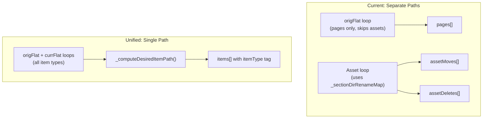

# Unify Save Pipeline Item Handling

## Part 0: Design Document

Create `docs/design/DESIGN-file-management.md` before any code changes. This document covers all file/item management behaviors in the nav menu, serving as the canonical reference for both the existing single-item movement system and the new multi-select feature.

### Document structure

Following the style of existing design docs (e.g., `DESIGN-declarative-save-planner.md`, `DESIGN-snapshot-nav-architecture.md`):

- **Overview**: File management in the focus mode nav menu -- movement, selection, and save pipeline
- **Item Types**: Pages, sections (with/without index), and assets. How each is represented in navData and how the save pipeline treats them
- **Single-Item Movement**: The existing `_handleArrowClick` / `_doArrowMove` system, the 4 movement functions, shift variants (move-into-section, new folder), keyboard flow via `_globalKeydownRouter`, `_navKeyboardActiveItem` state, focus/scroll behavior, auto-expand/collapse of folders
- **Unified Save Pipeline**: `_computeDesiredItemPath` helper, unified `items[]` array in `_computeSavePlan`, `_planDiskOperations` processing all item types, batch ordering (assets in batch1, pages in batch2). Replaces the previous separate page/asset code paths
- **Multi-Select Group Movement**: Selection model (individual, section, auto-promotion/downgrade), Cmd/Ctrl+Click toggle semantics, focal point (visual focal vs promoted movement focal), structural group movement algorithm, intermediate indexless folder creation, hierarchy preservation, escape behavior (two-tier)
- **Nav Controls in Group Mode**: Focal item shows only arrows. Other selected items have `visibility: hidden` controls. Non-selected items are normal
- **Rules**: Numbered invariants for maintainability (same pattern as other design docs and `.mdc` rules)

The document captures the full plan contents from Parts 1 and 2 below in design-doc format, plus documents the existing single-item behavior that is currently only implicitly described across `DESIGN-focus-nav-menu.md` and `DESIGN-snapshot-nav-architecture.md`.

---

## Part 1: Fix Asset Move Bug + Unify Save Pipeline

## Problem

The moved item (`__nav_51`) is an **asset** (`.png`), not a page. The debug logs confirm:

- In `origFlat`: `parentUid=__nav_48` (images section), `parentDir=images`
- In `currFlat`: `parentUid=__nav_57` (new test section), `parentDir=images/test`
- But `srcPath=images/deployStage-input_friendly_sub_env_name.png` is **identical** in both

The page path fix (using `_resolveDesiredDir`) never fires because `_computeSavePlan` skips assets on line 12016: `if (origEntry.itemType === 'asset') continue;`. The separate asset loop (lines 12144-12161) only detects moves via `_sectionDirRenameMap` (section renames), which doesn't cover items moving *between* sections.

## Design

Replace the three separate item-processing code paths (pages in origFlat loop, new pages in currFlat loop, assets in dedicated asset loop) with a **single unified `items` array** using a shared `_computeDesiredItemPath` helper.




### Shared helper: `_computeDesiredItemPath`

Placed just before `_computeSavePlan` (~line 11949). Used for both pages and assets:

```javascript
function _computeDesiredItemPath(uid, currFlat, resolveDesiredDir) {
  var entry = currFlat[uid];
  if (!entry || !entry.srcPath) return null;
  var fileName = entry.srcPath.split('/').pop();
  var parentDir = '';
  if (entry.parentUid && currFlat[entry.parentUid] && currFlat[entry.parentUid].folderDir) {
    parentDir = resolveDesiredDir(entry.parentUid) || '';
  }
  return parentDir ? parentDir + '/' + fileName : fileName;
}
```

### Unified item entry shape

```javascript
{
  uid: string,
  diskPath: string|null,       // from origFlat (null for new items)
  desiredPath: string|null,    // from tree position (null for deleted items)
  itemType: 'page' | 'asset',
  isNew: boolean,
  isDeleted: boolean,
  // Page-only fields (null/false for assets):
  isIndex: boolean,
  desiredFm: object|null,
  origFm: object|null,
  setContent: string|null,
  createContent: string|null,
  newFrontmatter: boolean
}
```

### Changes to `_computeSavePlan` (~lines 11949-12188)

- **Remove** `if (origEntry.itemType === 'asset') continue;` (line 12016)
- **Remove** the entire asset-specific block (lines 12125-12175: `_sectionDirRenameMap`, `assetMoves`, `assetDeletes`, `currentAssetPaths`)
- **Unify** the origFlat loop to handle both pages and assets, using `_computeDesiredItemPath` for desired path
- **Unify** the currFlat loop to add new assets alongside new pages
- **Rename** output field from `pages` to `items`
- **Remove** output fields: `assetMoves`, `assetDeletes`, `currentAssetPaths`

### Changes to `_planDiskOperations` (~lines 12165-12434)

All loops change from `desiredState.pages` to `desiredState.items`. Within each loop, branch by `itemType` where the operation differs:

- **Folder rename detection** (line 12207): Iterate `items` -- works unchanged since both pages and assets have `diskPath` and `desiredPath`
- **precomputedRenames** (line 12283): Iterate `items` -- no type distinction needed
- **Folder delete check** (line 12302): Iterate `items` -- replaces the current pages check + `currentAssetPaths` check. An asset with `!isDeleted` whose `desiredPath` starts with `secPrefix` counts as a living child
- **Asset moves batch1** (line 12333): Currently iterates `assetMoves`. Replace with: iterate `items` where `itemType === 'asset'` and `diskPath !== desiredPath` and not covered by folder rename. Emit `move-file` into `batch1`
- **Deletes** (line 12351): Single loop over `items`. `delete-page` for pages, `delete-file` for assets
- **Moves** (line 12362): Single loop over `items`. `rename-page` for pages (goes to `batch2MoveFiles`), assets already handled in batch1
- **Creates** (line 12375): Skip assets (only pages are created via nav)
- **Content migration** (line 12385): Skip assets (no frontmatter)
- **allRenames** (line 12408): Single loop over `items` -- replaces pages + assetMoves loops
- **deletedPaths** (line 12418): Single loop over `items`

### Batch ordering preserved

- batch1: folder renames, folder deletes, **asset moves** (from unified items)
- [wait-for-rebuild]
- batch2: mkdocsYml, deletes, **page moves**, converts, create-folders, creates, content migration

### Debug logging removal

Remove all `console.log('[DEBUG` statements added during investigation (~15 statements across `_flattenNavTree`, `_computeSavePlan`, `_planDiskOperations`, `_executeNavBatchSave`).

### What stays the same

- `_flattenNavTree` -- unchanged, already handles all types
- `_resolveDesiredDir` -- unchanged, used by the helper
- Movement functions (`_moveNavItemUp/Down/Left/Right`) -- unchanged, already type-agnostic
- Executors (`_executeRenamePageOp`, `_executeMoveFileOp`, etc.) -- unchanged
- `_dispatchSingleOp` routing -- unchanged
- Sections processing in `_computeSavePlan` -- unchanged
- `createFolderOps` and `convertOps` extraction -- unchanged

---

## Part 2: Cmd/Ctrl+Click Multi-Select for Group Movement

### Interaction model

- **Cmd+Click** (macOS) / **Ctrl+Click** (Windows/Linux) on a nav item toggles it into or out of a selection group
- The **last item clicked** is the visual focal for scroll centering and highlighting
- On **arrow key press**, the focal auto-promotes to the **shallowest-depth selected item** (first in tree order at that depth). The group moves as a structural unit around this promoted focal
- All selected items preserve their **relative hierarchy** -- child paths are recreated at the destination via intermediate indexless folders
- **Escape** clears the group selection (items stay in place). A second Escape triggers the normal discard flow
- Any item type (page, section, asset) can be selected

### Selection modes and auto-promotion

Each selection entry has one of three modes:

- **individual** -- a single page/asset. If deeper than the group's shallowest level, carries its relative parent path (intermediate indexless folders created at the destination)
- **section** -- a folder including its index and ALL children. Created by Cmd+clicking a section label. Children move implicitly
- **section-exclude** -- a section where a child has been Cmd+clicked OUT. Internally tracked as individual selections of the remaining children

**Auto-promotion**: when individually-selected items accumulate to cover all non-index children of a section, the selection auto-promotes to **section** mode (whole folder move including index).

**Downgrade**: Cmd+clicking a child out of a whole-section selection removes that child and converts the entry to individual selections of the remaining children.

### State

New variables near `_navKeyboardActiveItem` (~line 7873):

```javascript
var _navSelectedGroup = [];       // Array of { item, mode, excludedUids? }
                                  // mode: 'individual' | 'section'
var _navGroupFocalItem = null;    // Last Cmd/Ctrl-clicked item (visual focal)
var _navGroupMoveFocal = null;    // Promoted focal for movement (shallowest, first in tree order)
```

`_navKeyboardActiveItem` is set to `_navGroupFocalItem` during selection, and to `_navGroupMoveFocal` when an arrow key fires.

### Focal point promotion

When an arrow key is pressed with an active group:

1. Compute the depth (nesting level in `liveWysiwygNavData`) of each top-level selection
2. Find the minimum depth
3. Among items at that depth, pick the first in depth-first tree order
4. Set `_navGroupMoveFocal` to that item. Set `_navKeyboardActiveItem` to it
5. Scroll to and visually focus the promoted focal

Example: user selected `foo` (root), `bar` (root), `bat/baz` (depth 1). Focal promotes to `foo`. The group moves as a root-level block.

### Cmd/Ctrl+Click handler

Modify the `<a>` click handler (line 10113) and section label click handler (line 9928). When `(e.metaKey || e.ctrlKey)` and `_navEditMode`:

**Adding a page/asset:**

- Push `{ item, mode: 'individual' }` to `_navSelectedGroup`
- Apply `live-wysiwyg-nav-item--selected` CSS to its `<li>`
- Set `_navGroupFocalItem`, scroll to it
- Check auto-promotion: if all non-index siblings in the parent section are now selected, convert individual entries to a single `{ item: parentSection, mode: 'section' }` entry

**Adding a section:**

- Push `{ item, mode: 'section' }` to `_navSelectedGroup`
- Apply `live-wysiwyg-nav-item--selected` to the section `<li>` AND all descendant `<li>` elements
- Set `_navGroupFocalItem` to the section

**Removing a page/asset:**

- If it was part of a section selection: downgrade -- remove the section entry, add individual entries for each remaining child
- Otherwise: remove its entry from `_navSelectedGroup`
- Remove CSS. If group is now empty, clear all state

**Removing a section:**

- Remove the section entry and all implicit children from visual state
- If group is now empty, clear all state

**Prevent** default behavior (navigation / expand-collapse) when modifier is held.

### Group movement algorithm

Group movement is a **structural tree operation**, not per-item iteration of existing move functions:

1. **Promote focal** to shallowest depth
2. **Resolve effective items**: expand section selections to include all children. Filter to top-level items only (those whose parent is not also selected)
3. **Record relative structure**: for each top-level item, compute its depth relative to the shallowest level. Items deeper than the shallowest carry a relative parent path (e.g., `bat/baz` in a root-level group has relative path `bat/baz` with `bat` as an intermediate directory)
4. **Extract all items** from their current tree positions (splice out of `liveWysiwygNavData`)
5. **Move the focal item** using the existing single-item `_moveNavItemUp/Down/Left/Right`. This establishes the insertion point
6. **Re-insert sibling items** at the same level as the focal, adjacent to it, preserving their original relative order among themselves
7. **Recreate sub-structure** for deeper items: create intermediate synthetic sections (`_new: true`, `skipIndex: true`, indexless) and nest the items inside. Push `create-folder` ops with `skipIndex: true` to `_navBatchQueue`
8. **Exception for whole-section selections**: if the original folder is part of the group as a section selection, it moves with its index intact -- no indexless wrapper needed
9. **Single `_commitNavSnapshot`** after all placements
10. **Visual update**: rebuild nav DOM, re-apply `live-wysiwyg-nav-item--selected` CSS, `_setNavFocus` and `_scrollNavItemToCenter` on the promoted focal

### Example walkthrough

File structure:

```
foo
bar
bat/baz
bat/bar
```

User Cmd+clicks: `foo`, `bar`, `bat/baz` (in that order).

- `_navSelectedGroup`: `[{foo, individual}, {bar, individual}, {bat/baz, individual}]`
- Visual focal: `bat/baz` (last clicked)
- `bat/bar` is NOT selected -- it stays behind

User presses Arrow Down:

1. Focal promotes to `foo` (shallowest depth = root, first in tree order)
2. Top-level items: `foo` (depth 0), `bar` (depth 0), `bat/baz` (depth 1, relative path = `bat/baz`)
3. All three extracted from tree
4. `foo` (focal) moves down one position
5. `bar` inserted as sibling after `foo`
6. Synthetic indexless `bat` section created, `baz` placed inside it, section inserted after `bar`
7. `bat/bar` remains in the original `bat/` folder (untouched)

Result:

```
(whatever was above)
foo           <- promoted focal, focused + selected
bar           <- selected
bat/baz       <- selected (in new indexless bat/ wrapper)
bat/bar       <- stayed behind in original bat/
```

### Escape behavior

Two-tier escape in `_globalKeydownRouter`:

```javascript
if (e.key === 'Escape') {
  if (dialogOpen) return;
  if (_navEditMode) {
    if (_navSelectedGroup.length > 0 || _navKeyboardActiveItem) {
      e.preventDefault(); e.stopImmediatePropagation();
      _clearNavGroup();
      _clearNavFocus();
      return;
    }
    e.preventDefault(); e.stopImmediatePropagation();
    _confirmNavDiscard();
    return;
  }
}
```

`_clearNavGroup`: removes `live-wysiwyg-nav-item--selected` from all `<li>` elements, empties `_navSelectedGroup`, nulls `_navGroupFocalItem` and `_navGroupMoveFocal`. Items stay in their moved positions. Snapshot state untouched.

### Visual feedback and nav controls

**Selection outlines**: Each selected item gets the same outline style that a single focused item currently has. The class `live-wysiwyg-nav-item--selected` reuses the existing `live-wysiwyg-nav-item--focused` outline rules (applied per-`<li>`, not as a group bounding box). The focal item has both classes.

**Nav controls visibility in group mode** (`_navSelectedGroup.length > 1`):

- **Focal item**: shows only the 4 movement arrow buttons. The target icon and settings gear are **hidden** (`display: none`)
- **Other selected items**: all nav control buttons are hidden. To preserve layout (so items don't shift horizontally), the buttons are rendered with `visibility: hidden` rather than `display: none`. This keeps the horizontal spacing identical to when buttons are visible
- **Non-selected items**: nav controls remain in their normal state (arrows, gear, target all visible as usual)

Implementation: when the group count transitions from 1-to-2+ or 2+-to-1/0, toggle a parent-level class `live-wysiwyg-nav-group-active` on `_navSidebarEl`. CSS rules keyed on this class plus `--selected` / `--focused` handle the visibility:

```css
.live-wysiwyg-nav-group-active .live-wysiwyg-nav-item--selected .live-wysiwyg-nav-target-btn,
.live-wysiwyg-nav-group-active .live-wysiwyg-nav-item--selected .live-wysiwyg-nav-gear-btn {
  visibility: hidden;
}
.live-wysiwyg-nav-group-active .live-wysiwyg-nav-item--selected:not(.live-wysiwyg-nav-item--focused) .live-wysiwyg-nav-arrow-btn {
  visibility: hidden;
}
```

### What does NOT change

- `_moveNavItemUp/Down/Left/Right` -- used for the focal item's single-step movement. Other items are structurally placed relative to it
- The save pipeline (Part 1) -- unified `items[]` handles all moved items. Intermediate indexless folders appear as new sections in the tree diff
- Undo/redo -- snapshots capture full tree state; group moves undo/redo atomically
- Batch queue -- structural group move pushes ops per top-level moved item plus `create-folder` ops for intermediate wrappers. Save plan diff compares tree snapshots

