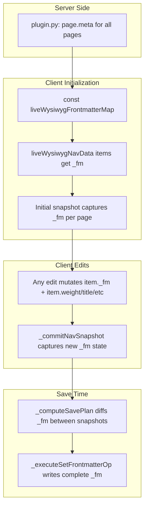

# Virtualized Frontmatter in Nav Snapshots

## Architecture




## 1. Server-side: Inject full frontmatter map

**File:** [plugin.py](mkdocs-live-wysiwyg-plugin/mkdocs_live_wysiwyg_plugin/plugin.py)

In `on_page_content` (around line 418), add a new const:

```python
fm_map = {}
for p in nav_ref.pages:
    fm_map[p.file.src_path] = dict(p.meta) if p.meta else {}
preamble_parts.append(
    f"const liveWysiwygFrontmatterMap = {json.dumps(fm_map)};\n"
)
```

MkDocs' `page.meta` is a dict from `yaml.safe_load` containing all frontmatter key-value pairs. This captures the complete frontmatter for every page in the nav at build time.

**Also update [api_server.py](mkdocs-live-wysiwyg-plugin/mkdocs_live_wysiwyg_plugin/api_server.py)** (line 174-183): return the full parsed frontmatter dict for hidden pages (not just the 5 nav-weight fields), so hidden pages also get complete `_fm` when added to navData.

## 2. Client-side: Attach `_fm` to navData items on load

**File:** [live-wysiwyg-integration.js](mkdocs-live-wysiwyg-plugin/mkdocs_live_wysiwyg_plugin/live-wysiwyg-integration.js)

After `liveWysiwygNavData` is populated and UIDs are assigned, walk the tree and attach `_fm`:

```javascript
function _attachFrontmatterToNavData(items) {
    var fmMap = typeof liveWysiwygFrontmatterMap !== 'undefined'
        ? liveWysiwygFrontmatterMap : {};
    (function walk(list) {
        for (var i = 0; i < list.length; i++) {
            var item = list[i];
            if (item.type === 'page' && item.src_path) {
                item._fm = fmMap[item.src_path]
                    ? Object.assign({}, fmMap[item.src_path])
                    : {};
            }
            if (item.children) walk(item.children);
        }
    })(items);
}
```

Call this once during initial nav setup, before the first `_commitNavSnapshot()`.

`_fm` is a plain object like `{ title: "My Page", weight: 100, headless: true, description: "..." }`. It's the complete frontmatter fields dict.

`**_deepCloneNavData**` must deep-clone `_fm` (using `Object.assign({}, item._fm)` or equivalent).

## 3. All frontmatter mutations update `_fm`

Every place that modifies `item.weight`, `item.title`, `item.headless`, `item.retitled`, or `item.empty` must also update `item._fm`:

- **Weight normalization** (`_applyNormalizeFolderToNavData`, `_applyNormalizeWeightsToNavData`): when setting `target.weight = w`, also set `target._fm.weight = w` (and same for `index_meta` paths)
- **Migration** (`_applyMigrationToNavData`): newly created page items get `_fm` built from the migration-computed fields. Existing pages get `_fm` from the frontmatter map.
- **Title changes** (markdown sync, settings): set `item._fm.title = newTitle`
- **Headless toggle**: set `item._fm.headless = val`
- **New pages**: set `_fm` with the fields being written to the file
- **Index page creation**: set `_fm = { title, retitled: true, empty: true, weight: indexWeight }`

## 4. Save plan: Compare `_fm` between snapshots

`**_computeSavePlan`** (line ~10757): Replace the individual field comparisons with a single `_fm` diff:

```javascript
// Current (bug-prone):
if (currE.weight !== origE.weight && currE.weight != null) { ... }
if (currE.title !== origE.title && currE.title) { ... }
if (currE.headless !== origE.headless) { ... }

// New: compare entire _fm objects
var currFm = currE.item._fm || {};
var origFm = origE.item._fm || {};
var fmChanged = false;
for (var fk in currFm) {
    if (currFm[fk] !== origFm[fk]) { fmChanged = true; break; }
}
if (!fmChanged) {
    for (var fk2 in origFm) {
        if (!(fk2 in currFm)) { fmChanged = true; break; }
    }
}
if (fmChanged) {
    batch2ContentMigration.push({
        type: 'set-frontmatter',
        src_path: currE.srcPath,
        fm: currFm,
        isIndex: currE.srcPath.endsWith('index.md')
    });
}
```

The op now carries the complete target `fm` state, not partial updates.

`**_flattenNavTree**`: Add `item` reference (already present) so `_computeSavePlan` can access `item._fm`.

## 5. Save executor: Write complete frontmatter from `_fm`

`**_executeSetFrontmatterOp**` (line 11714): Change from merge-update to full-replace:

```javascript
function _executeSetFrontmatterOp(op) {
    var actualPath = _resolveChainedRename(op.src_path);
    if (_batchDeletedPaths[actualPath]) return Promise.resolve();
    return _wsGetContents(actualPath).then(function (content) {
        var parsed = _parseFrontmatter(content);
        var body = parsed.hasBlock
            ? content.substring(parsed.bodyStart) : content;
        var newFm = _buildFrontmatterFromFm(op.fm, op.isIndex);
        return _wsSetContents(actualPath, newFm + body);
    });
}
```

New helper `_buildFrontmatterFromFm(fm, isIndex)` takes a plain fields dict and builds the `---\n...\n---\n` string. Uses the same ordering convention as `_buildFrontmatterString` (title first, then alpha-sorted other fields, weight last). Applies `shouldStrip` to omit default values. This is simpler than the current `_buildFrontmatterString` because there's no `lines` array to preserve — just a flat dict.

## 6. Fix: Weight normalization skips section index pages

**Bug:** `_applyNormalizeFolderToNavData` (line 11958) and `_applyNormalizeWeightsToNavData` (line 11995) use `_isRootIndex(item)` which only matches `src_path === 'index.md'`. Section index pages (e.g., `contributing/index.md`) pass through and get counted, bumping all sibling weights by 100.

**Fix both functions:** Change the skip condition from `_isRootIndex(child)` to `child.isIndex`:

```javascript
// _applyNormalizeFolderToNavData:
if (child.type === 'page') {
    if (child.isIndex) continue;   // was: _isRootIndex(child)
    orderedItems.push(child);
}

// _applyNormalizeWeightsToNavData:
if (item.type === 'page') {
    if (item.isIndex) {            // was: _isRootIndex(item)
        item.weight = null;
        continue;
    }
    orderedItems.push(item);
}
```

Section index pages get their weight from the parent section's `index_meta.weight`, not from the sequential assignment.

Also update `_fm` when setting weights (per item 3 above).

## 7. Fix: Link rewrite uses wrong page directory

**Bug:** `_rewriteAllMovedLinksInPage(content, renameMap, pageSrcPath)` uses `_getDir(pageSrcPath)` (the OLD directory) to compute new relative paths. If the page itself was renamed/moved, the new relative paths are wrong (e.g., `lifecycles.md` becomes `../jervis-yaml-jervis-yml/lifecycles.md`).

**Fix:** Add a `newPageSrcPath` parameter. Use old dir for resolving existing link targets (they were written relative to the old location). Use new dir for computing replacement relative paths:

```javascript
function _rewriteAllMovedLinksInPage(content, renameMap, pageSrcPath, newPageSrcPath) {
    var oldPageDir = _getDir(pageSrcPath);
    var newPageDir = _getDir(newPageSrcPath || pageSrcPath);
    // ... resolve targets against oldPageDir ...
    // ... compute new relative paths from newPageDir ...
}
```

Update `_executeRewriteLinksOp` to pass the new path:

```javascript
var newPagePath = renameMap[pagePath] || pagePath;
var updated = _rewriteAllMovedLinksInPage(content, op.renameMap, pagePath, newPagePath);
```

## 8. Fix: Headless not preserved during migration

**Bug:** `_applyMigrationToNavData` builds page items (line 13517) without copying `headless` from the existing page. Pages like `nested-agents.md` that had `headless: true` lose it.

**Fix:** With virtualized `_fm`, migration copies `_fm` from the frontmatter map for existing pages. The headless flag is automatically preserved because the complete frontmatter is copied. Normalization and weight assignment then update only `_fm.weight`, leaving `_fm.headless` intact.

## 9. Investigate: best-practices.md deletion

The migration deleted `docs/pipeline-steps/best-practices.md` entirely. This needs investigation — likely the page wasn't found in the mkdocs.yml nav structure and something in the hidden page handling or delete logic incorrectly removed it. This is a separate bug from the frontmatter issues and should be debugged during implementation.

## Files changed

- [plugin.py](mkdocs-live-wysiwyg-plugin/mkdocs_live_wysiwyg_plugin/plugin.py) — inject `liveWysiwygFrontmatterMap`
- [api_server.py](mkdocs-live-wysiwyg-plugin/mkdocs_live_wysiwyg_plugin/api_server.py) — return full meta for hidden pages
- [live-wysiwyg-integration.js](mkdocs-live-wysiwyg-plugin/mkdocs_live_wysiwyg_plugin/live-wysiwyg-integration.js) — all client-side changes

