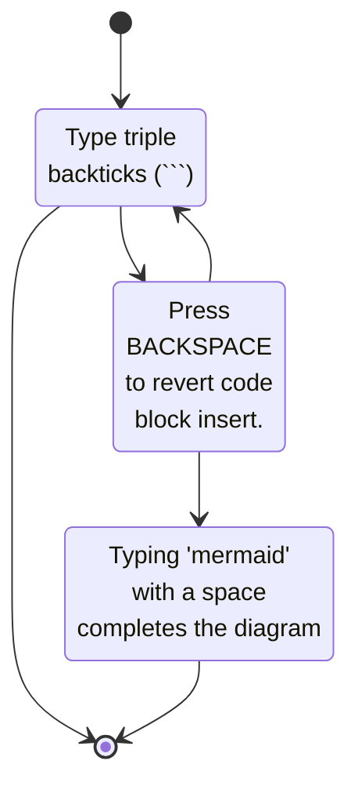

# Mermaid Diagramming Tutorial

You can create mermaid diagrams.  Just inline type ```` ```mermaid ```` and a mermaid diagram will appear.  The following mermaid diagram describes how you inline type to create a diagram starting on an empty paragraph.


## How to create a diagram




## Try it out

Create an empty paragraph below this line and try to insert your own diagram.  You can maximize the initial diagram to see other samples in the diagram editor.
